# 清江许氏族谱
## 项目地址
https://github.com/Nexiuss/genealogy-hsu
## 概述
[清江许氏族谱.md](清江许氏族谱.md)
## 初修序
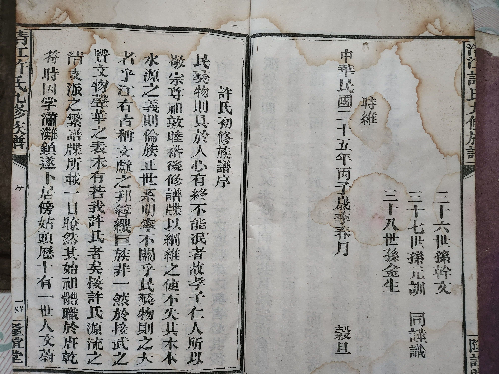
1. **三十六世孫幹文** → 三十六世孙干文
   （家族第三十六代孙干文）
2. **三十七世孫元訓** → 三十七世孙元训
   （家族第三十七代孙元训）
3. **三十八世孫金生** → 三十八世孙金生
   （家族第三十八代孙金生）
4. **中華民國二十五年丙子嵗季春月** → 中华民国二十五年丙子岁季春月
   （公元1936年农历丙子年三月）
5. **穀旦** → 谷旦
   （良辰吉日）
6. **民彛物則具於人心有終不能冺者故孝子仁人所以** → 民彝物则具于人心有终不能泯者故孝子仁人所以
   （伦理纲常根植人心永不磨灭，因此孝子仁人）

7. **敬宗尊祖敦睦裕後修譜牒以綱維之使不失其木本水源之義則倫族正世系明寧不關乎民彛物則之大者乎** → 敬宗尊祖敦睦裕后修谱牒以纲维之使不失其木本水源之义则伦族正世系明宁不关乎民彝物则之大者乎
   （敬奉祖先和睦后代修撰族谱维系宗族，使不忘根本，如此则伦理正世系明，岂非关乎人伦大义）

8. **江有古稱文獻之邦簪纓巨族非一然於接武之贒文物聲華之表未有若我許氏者矣** → 江有古称文献之邦簪缨巨族非一然于接武之踵文物声华之表未有若我许氏者矣
   （本地自古文风鼎盛望族众多，但在延续文脉彰显门第方面无出我许氏之右者）

9. **按許氏源流之清支派之繁譜牒所載一目瞭然其始祖體職於唐乾符時因掌瀟灘鎮遂卜居傍姑頭厯十有一世人文蔚** → 按许氏源流之清支派之繁谱牒所载一目了然其始祖体职于唐乾符时因掌潇滩镇遂卜居傍姑头历十有一世人文蔚
   （考许氏族谱记载清晰：始祖于唐乾符年间任职潇滩镇，定居傍姑头，传十一世人文鼎盛）
## 新序-一号
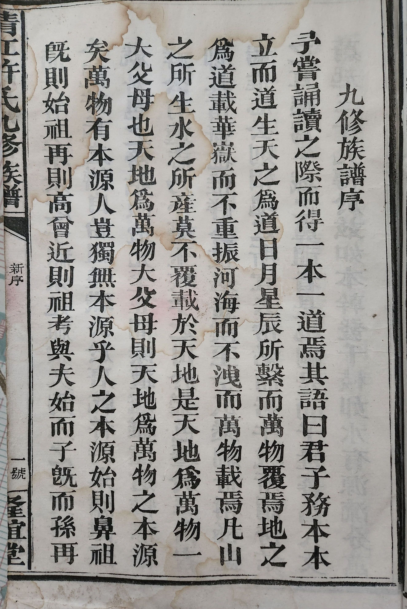
1. **九修族譜序 → 九修族谱序**  
   （第九次修订族谱的序言。）

2. **予嘗誦讀之際而得一本一道焉 → 予尝诵读之际而得一本一道焉**  
   （我在研读时领悟到"根本"与"道理"的关联。）

3. **其語曰君子務本本立而道生 → 其语曰君子务本本立而道生**  
   （古语说：君子致力于根本，根本确立后道理自然显现。）

4. **天之為道日月星辰所繫而萬物覆焉 → 天之为道日月星辰所系而万物覆焉**  
   （天的法则维系日月星辰，覆盖万物。）

5. **地之為道載華嶽而不重振河海而不洩而萬物載焉 → 地之为道载华岳而不重振河海而不泄而万物载焉**  
   （地的法则承载山岳不显沉重，容纳河海不会泄漏，托载万物。）

6. **凡山之所生水之所產莫不覆載於天地 → 凡山之所生水之所产莫不覆载于天地**  
   （一切山川物产皆由天地承载覆盖。）

7. **是天地為萬物一大父母也 → 是天地为万物一大父母也**  
   （因此天地是万物的父母。）

8. **天地為萬物大父母則天地為萬物之本源矣 → 天地为万物大父母则天地为万物之本源矣**  
   （天地作为万物的父母，便是万物的本源。）

9. **萬物有本源人豈獨無本源乎 → 万物有本源人岂独无本源乎**  
   （万物皆有本源，人怎会没有？）

10. **人之本源始則鼻祖既則始祖再則高曾近則祖考 → 人之本源始则鼻祖既则始祖再则高曾近则祖考**  
    （人的本源始于鼻祖，继而是始祖、高祖、曾祖，近则祖父。）

11. **與夫始而子旣而孫再 → 与夫始而子既而孙再**  
    （而后延续为子、孙，代代相传。）
## 新序-二号
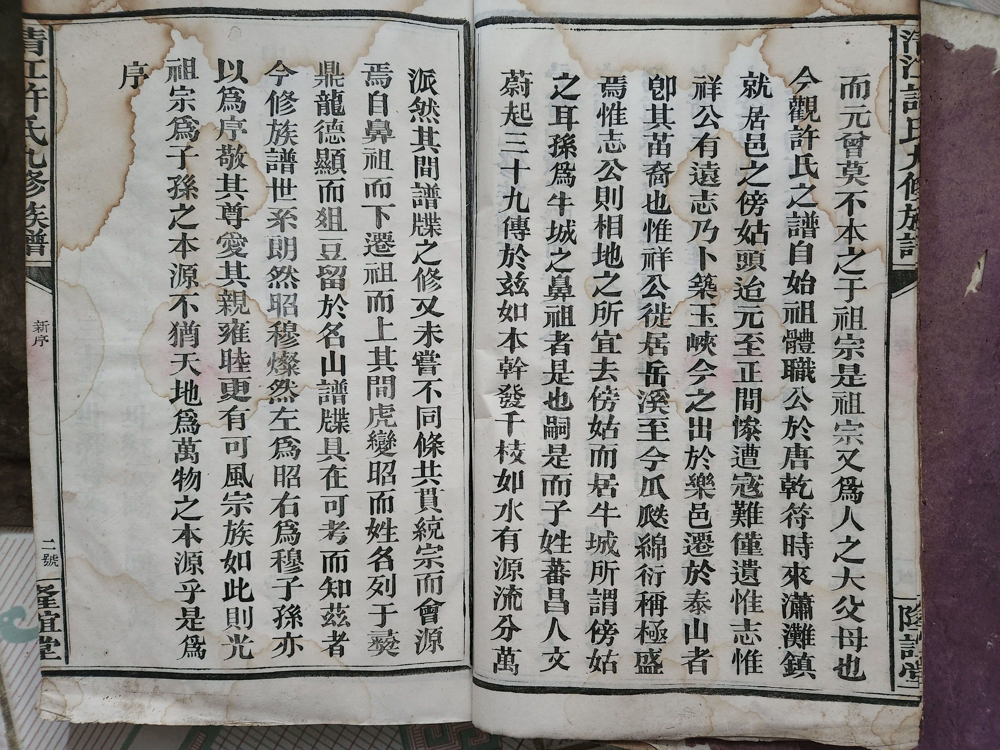
1. **而元會莫不本之于祖宗 → 而元会莫不本之于祖宗**  
   （一切根源皆来自祖先。）

2. **是祖宗又為人之大父母也 → 是祖宗又为人之大父母也**  
   （祖宗如同人的父母一般重要。）

3. **今觀許氏之譜 → 今观许氏之谱**  
   （如今查阅许氏家族的族谱。）

4. **自始祖體職公於唐乾符時來瀟灘鎮 → 自始祖体职公于唐乾符时来潇滩镇**  
   （始祖体职公在唐朝乾符年间迁至潇滩镇。）

5. **就居邑之傍姑頭 → 就居邑之傍姑头**  
   （定居在县城旁的姑头村。）

6. **迨元至正間遭寇難僅遺惟志惟祥公 → 迨元至正间遭寇难仅遗惟志惟祥公**  
   （到元朝至正年间遭遇战乱，仅存志公和祥公。）

7. **祥公有遠志乃卜築玉峽 → 祥公有远志乃卜筑玉峡**  
   （祥公有抱负，选择在玉峡定居。）

8. **惟志公則相地之所宜去傍姑而居牛城 → 惟志公则相地之所宜去傍姑而居牛城**  
   （志公则迁至风水更佳的牛城。）

9. **所謂傍姑之耳孫為牛城之鼻祖者是也 → 所谓傍姑之耳孙为牛城之鼻祖者是也**  
   （姑头的后代成为牛城的开基祖。）

10. **嗣是而子姓蕃昌人文蔚起 → 嗣是而子姓蕃昌人文蔚起**  
    （此后子孙繁盛，人才辈出。）
## 旧序-一号
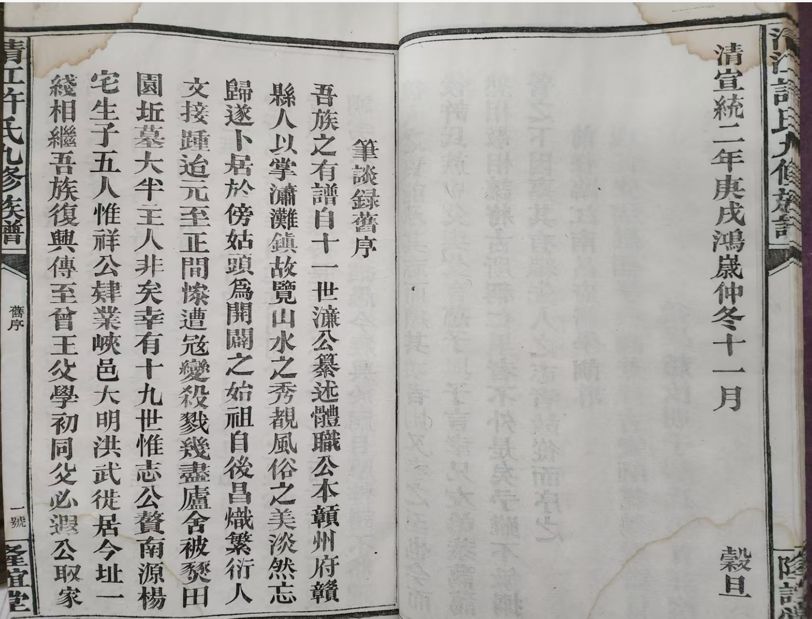
1. **清宣統二年庚戌鴻嵗仲冬十一月穀旦 → 清宣统二年庚戌鸿岁仲冬十一月谷旦**  
   （清朝宣统二年庚戌年，鸿岁（大吉之年）仲冬十一月吉日。）

2. **筆談録舊序 → 笔谈录旧序**  
   （笔谈录**的旧序言。）

3. **吾族之有譜自十一世濓公纂述體職公本贑州府贛縣人以掌瀟灘鎮故覽山水之秀覩風俗之美淡然忘歸遂卜居於傍姑頭為開闢之始祖自後昌熾繁衍人文接踵 → 吾族之有谱自十一世澜公纂述，体职公本赣州府赣县人，以掌澜滩镇故，览山水之秀，睹风俗之美，淡然忘归，遂卜居于傍姑头，为开闢之始祖，自后昌炽繁衍，人文接踵）  
   （我们家族有谱始于第十一世澜公纂述，体职公本是赣州府赣县人，因掌管澜滩镇，欣赏山水之美，观察风俗之美，忘却归途，于是选择在傍姑头定居，成为开闢之始祖，自那以后家族昌盛繁衍，人文辈出。）

4. **迨元至正間懷遭宼變殺戮幾盡廬舍被燹田園坵墓大半主人非矣幸有十九世惟志公贅南源楊宅生子五人惟祥公肄業峽邑大明洪武徙居今址 → 迨元至正间，怀遭寇变，杀戮几尽，庐舍被燹，田园坵墓大半主人非矣，幸有十九世惟志公赘于南源杨宅，生子五人，惟祥公肄业峡邑，大明洪武徙居今址）  
   （到了元至正年间，遭遇寇贼之变，杀戮几乎殆尽，房屋被焚毁，田园坟墓大半已易主，幸好有十九世惟志公入赘南源杨宅，生了五个儿子，其中惟祥公在峡邑求学，大明洪武年间迁居到现在的地方。）

5. **一綫相繼吾族復與傳至曾王父學初同父必遐公取家青江許氏九族普舊序 → 一线相继，吾族复兴，传至曾王父学初，同父必遐公，取家青江许氏，九族谱旧序）  
   （一线相传，我们家族得以复兴，传到了曾王父学初，同父必遐公，娶青江许氏为妻，续修了九族谱的旧序言。）
## 旧序-二号
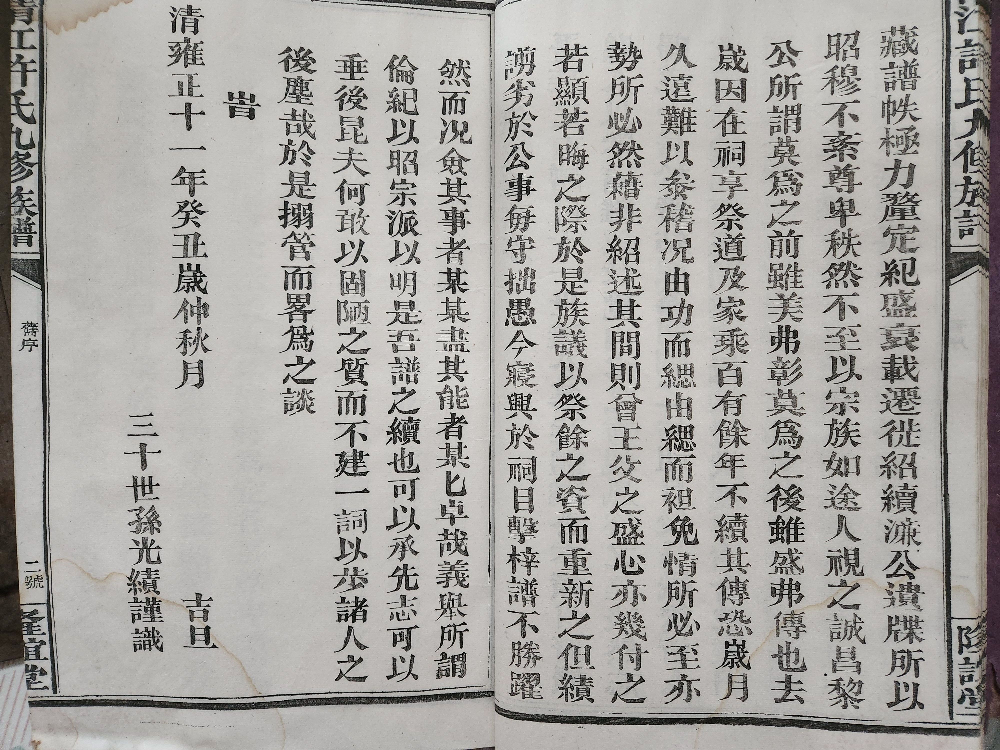
1. **藏譜帙極力釐定紀盛哀載遷徙紹續濂公遺牒所以 → 藏譜帙極力釐定紀盛衰載遷徙紹續濂公遺牒所以**  
   （藏族谱极为严谨地整理记载家族的兴衰、迁徙，继承濂公的遗稿，以使……）

2. **昭穆不紊尊卑秩然不至以宗族如途人視之 → 昭穆不紊，尊卑秩然，不至以宗族如途人視之**  
   （昭穆不乱，尊卑有序，不至于让宗族如同路人一般看待。）

3. **清雍正十一年癸丑歲仲秋月吉旦 → 清雍正十一年癸丑歲仲秋月吉旦**  
   （清雍正十一年癸丑年仲秋月的吉日。）

4. **三十世孫光績謹識 → 三十世孫光績謹識**  
   （第三十世孙光绩谨识。）

5. **於是族議以祭餘之資而重新之但績謭劣於公事每守撰愚今寢與於祠目擊梓譜不勝躍然 → 於是族議以祭餘之資而重新之，但績謭劣於公事，每守撰愚，今寢興於祠，目擊梓譜，不勝躍然**  
   （于是族人商议用祭祀余下的资金重新修订族谱，但我在公事上守拙愚钝，如今在祠堂中目睹新修的族谱，心中激动不已。）
## 旧序-三号

1. **金紫光禄大夫翰林集讌學士兼寳謨閤直學士楚國公 曾丰 頓首謹書** → 金紫光禄大夫翰林集宴学士兼宝谟阁直学士楚国公   曾丰 顿首谨书
   （宋代高级文官头衔：金紫光禄大夫为从一品散官，翰林集宴学士为文学侍从，宝谟阁直学士为殿阁职，楚国公为爵位）

2. **許氏二修族譜序** → 许氏二修族谱序  
   （许氏家族第二次修订族谱的序言）

3. **粤稽古帝王因生以賜姓胙之土而命之氏蓋有氏而** → 粤稽古帝王因生以赐姓胙之土而命之氏盖有氏而  
   （考证古代帝王根据出生赐姓、分封土地命氏，有姓氏而后...）

4. **後有派系有派系而後有譜牒有譜帙而後世代之久** → 后有派系有派系而后有谱牒有谱帙而后世代之久  
   （...而后有分支，有分支而后修族谱，有族谱才能维系世代传承）

5. **遠親屬之踴戻昭穆之尊卑可得而推矣宜春秋不與** → 远亲属之踊跃昭穆之尊卑可得而推矣宜春秋不与  
   （纵使亲属疏远，通过昭穆制度仍可推知尊卑，正如《春秋》不承认...）

6. **莒人之嗣鄧而子與氏謂天之生物一本也由本而幹** → 莒人之嗣邓而子与氏谓天之生物一本也由本而干  
   （引用典故：莒国继承邓国，说明万物同源，如树木由主干...）

7. **由幹而枝而條枝條肆此漆沮締瓞之說也然則祖其** → 由干而枝而条枝条肆此漆沮缔瓞之说也然则祖其  
   （...分出枝丫，正如《诗经》"绵绵瓜瓞"的比喻，故而尊崇...）

8. **本乎大宗幹也小宗枝也小宗而下又條枝條肆之散** → 本乎大宗干也小宗枝也小宗而下又条枝条肆之散  
   （宗法制度：大宗如树干，小宗如树枝，再分则更散逸）

9. **殊者也生齒繁庶則懼分誼之不明禮制之不秩而先** → 殊者也生齿繁庶则惧分谊之不明礼制之不秩而先  
   （人口繁衍时恐伦理混乱，故先贤...）

10. **會丰山堂首謹書** → 会丰山堂首谨书  
    （落款：丰山堂主事者恭撰。注："會"应为"惠"字之误，指谦敬用语）
## 旧序-四号
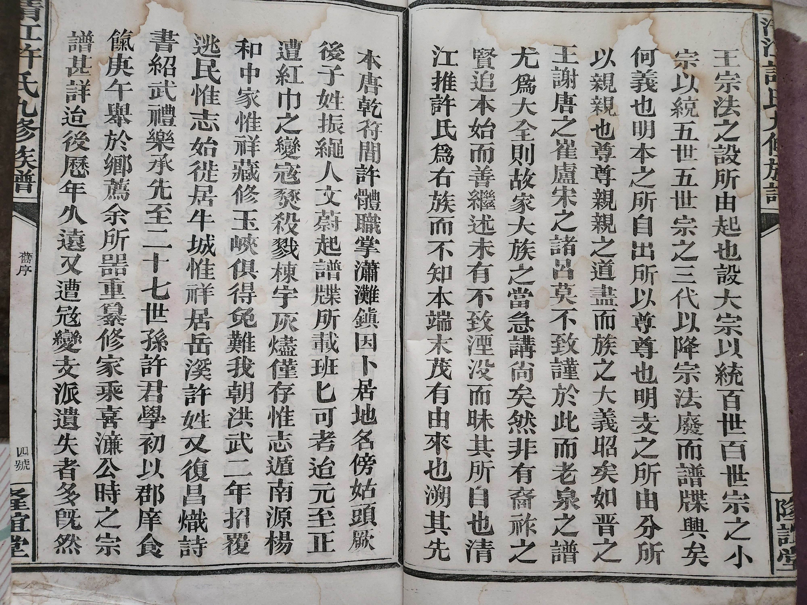
1. **王宗法之設所由起也** → 王宗法之设所由起也 （解释：王族宗法的设立是由何而起的）
2. **設大宗以統百世百世宗之小宗以統五世五世宗之** → 设大宗以统百世，百世宗之；小宗以统五世，五世宗之 （解释：设立大宗来统管百世，小宗来统管五世）
3. **三代以降宗法廢而譜牒興矣** → 三代以降，宗法废而谱牒兴矣 （解释：三代以后，宗法废除，而谱牒兴起）
4. **何義也明本之所自出所以尊尊也** → 何义也？明本之所自出，所以尊尊也 （解释：这是什么意义？明确本源出处，以此来尊崇祖先）
5. **明支之所由分所以親親也** → 明支之所由分，所以亲亲也 （解释：明确分支的来源，以此来亲近亲属）
6. **尊尊親親之道盡而族之大義昭矣** → 尊尊亲亲之道尽，而族之大义昭矣 （解释：尊崇祖先、亲近亲属的道义尽显，家族的大义就昭然了）
7. **如晋之王謝唐之崔盧宋之諸呂莫不致謹於此而老泉之譜尤爲大全** → 如晋之王谢，唐之崔卢，宋之诸吕，莫不致谨于此，而老泉之谱尤为大全 （解释：如晋代的王谢，唐代的崔卢，宋代的诸吕，都对此非常谨慎，而欧阳修的谱牒尤为全面）
8. **則故家大族之當急講尚矣然非有裔祚之賢追本始而善繼述未有不致湮没而昧其所自也** → 则故家大族之当急讲尚矣，然非有裔祚之贤，追本始而善继述，未有不致湮没而昧其所自也 （解释：所以故家大族应当急切地讲求，然而没有贤能的子孙追溯本源并善继前人，就没有不致湮没而不知其所自的）
9. **清江推許氏爲有族而不知本端末茂有由來也** → 清江推许氏为有族而不知本，端末茂有由来也 （解释：清江推许氏为有族却不知本源，其末端茂盛是有由来的）
10. **溯其先本唐乾符間許體職掌瀟灘鎮因卜居地名傍姑頭厥後子姓振繩人文蔚起** → 溯其先，本唐乾符间，許體职掌瀟灘鎮，因卜居地名傍姑頭，厥後子姓振繩，人文蔚起 （解释：追溯其先祖，本是唐乾符年间，许体职掌潇滩镇，因此择地而居在傍姑头，后来子孙振兴，人文蔚起）
11. **譜牒所載班匕可考迨元至正遭紅巾之變宼燹殺戮棟宇灰燼僅存惟志遁南源楊** → 谱牒所载，班匕可考，迨元至正，遭红巾之变，寇燹杀戮，棟宇灰烬，僅存惟志，遁南源楊 （解释：谱牒所载，班次可考，到了元至正年间，遭遇红巾之变，寇贼焚杀，房屋尽毁，仅存志向，遁入南源杨）
12. **和中家惟祥藏修玉峽俱得免難我朝洪武二年招覆逃民惟志始徙居牛城惟祥居岳溪** → 和中家惟祥，藏修玉峡，俱得免难，我朝洪武二年，招覆逃民，惟志始徙居牛城，惟祥居岳溪 （解释：和中家的惟祥，藏修于玉峡，都得以免难，我朝洪武二年，招抚逃民，惟志开始徙居牛城，惟祥居住在岳溪）
13. **許姓又復昌熾詩書紹武禮樂承先** → 许姓又复昌炽，诗书绍武，礼乐承先 （解释：许姓又复昌盛，诗书传承武德，礼乐承继先祖）
14. **至二十七世孫許君學初以郡庠食值庚午舉於鄉薦余所噐重泉修家乘** → 至二十七世孙许君学初，以郡庠食，值庚午举于乡，荐余所器重，泉修家乘 （解释：到了二十七世孙许君学初，以郡庠生的身份，在庚午年乡试中举，被我所器重，他修订了家谱）
15. **喜濓公時之宗譜甚詳迨後厯年久遠又遭宼變支派遣失者多** → 喜濓公时之宗谱甚详，迨后历年久远，又遭寇变，支派遣失者多 （解释：喜濓公时的宗谱非常详细，但到后来历年久远，又遭遇寇贼之变，支派遣失的人很多）
## 旧序-五号
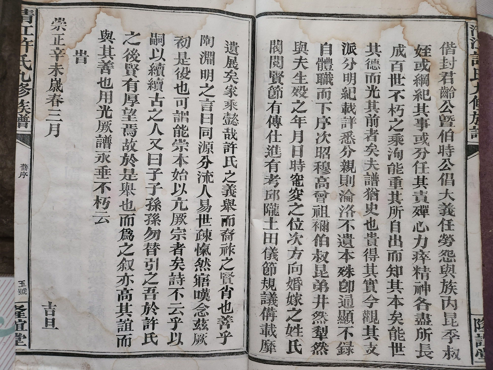
1. **借封君齡公暨伯時公倡大義任勞怨 → 借封君龄公暨伯时公倡大义任劳怨**  
   （借封君龄公与伯时公倡导大义，不辞劳怨。）

2. **與族內昆季叔姪或綱紀其事或分任其責 → 与族内昆季叔侄或纲纪其事或分任其责**  
   （与族内的兄弟叔侄一起，有的负责规划事务，有的分担职责。）

3. **殫心力瘁精神各盡所長 → 殚心力瘁精神，各尽所长**  
   （竭尽心力，各自发挥所长。）

4. **成百世不朽之乘洵能重其所自出而知其本矣 → 成百世不朽之乘，洵能重其所自出而知其本矣**  
   （编纂成百世不朽的族谱，确实能重视根源，了解根本。）

5. **能世其德而光其前者矣夫 → 能世其德而光其前者矣夫**  
   （能够传承其德行，光耀前人。）

6. **夫譜猶史也貴得其實 → 夫谱犹史也，贵得其实**  
   （族谱就像历史一样，贵在真实。）

7. **今觀其支派分明紀載詳悉 → 今观其支派分明，记载详悉**  
   （现在看其支派分明，记载得非常详细。）

8. **分親則淪洛不遺本殊卽通顯不録 → 分亲则沦洛不遗，本殊即通显不录**  
   （亲疏分明，即使是沦落在洛阳的也不遗漏，本族特殊人物即使显贵也不特别记录。）

9. **自體職而下序次昭穆高曾祖禰伯叔昆弟井然犁然 → 自体职而下，序次昭穆，高曾祖祢伯叔昆弟，井然犁然**  
   （从体职开始往下，按照昭穆次序排列，高祖、曾祖、祖父、父亲、伯父、叔父、兄弟等，井然有序。）

10. **與夫生殁之年月日時窀安之位次方向 → 与夫生殁之年月日时，窀安之位次方向**  
    （以及生卒年月日时，安葬的位次和方向。）

11. **婚嫁之姓氏閥閱賢節有傳仕進有考 → 婚嫁之姓氏，阀阅贤节有传，仕进有考**  
    （婚嫁的姓氏，以及有阀阅、贤节的传记，仕宦进升的考核。）

12. **邱隴土田儀節規議備載靡遺 → 邱陇土田，仪节规议备载靡遗**  
    （墓地、土地，以及礼仪节规、规定议定都详细记载，没有遗漏。）

13. **展矣家乘懿哉許氏之義舉 → 展矣家乘，懿哉许氏之义举**  
    （真是了不起的家谱，许氏的义举真是美好啊。）

14. **裔祚之賢肖也善乎陶淵明之言曰同源分流 → 裔祚之贤肖也，善乎陶渊明之言曰同源分流**  
    （后裔的贤良与肖似，正如陶渊明所说：“同源分流”。）

15. **人易世疎愾然寤嘆念茲厥初 → 人易世疏，愾然寤叹，念兹厥初**  
    （人世变迁，容易疏远，不禁感慨叹息，怀念这最初的时刻。）

16. **是役也可謂能宗本始以亢厥宗者矣 → 是役也，可谓能宗本始以亢厥宗者矣**  
    （这次修谱的行动，可以说是能够尊崇本源，振兴宗族的了。）

17. **詩不云乎以嗣以續續古之人 → 诗不云乎？以嗣以续，续古之人**  
    （诗经上不是说吗？要继承要延续，延续古人的传统。）

18. **又曰子子孫孫勿替引之吾於許氏之後賢有厚望焉 → 又曰子子孙孙勿替引之，吾于许氏之后贤有厚望焉**  
    （又说子子孙孙不要断绝，我对许氏的后代贤人有深切的期望。）

19. **故於是舉也而為之叙亦高其誼而與其善也 → 故于是举也，而为之叙，亦高其谊而与其善也**  
    （因此，对于这次修谱的行动，我为之作序，也赞扬他们的情谊与善行。）

20. **用光厥譜永垂不朽云 → 用光厥谱，永垂不朽云**  
    （用来光耀族谱，使之永垂不朽。）
## 旧序-六号
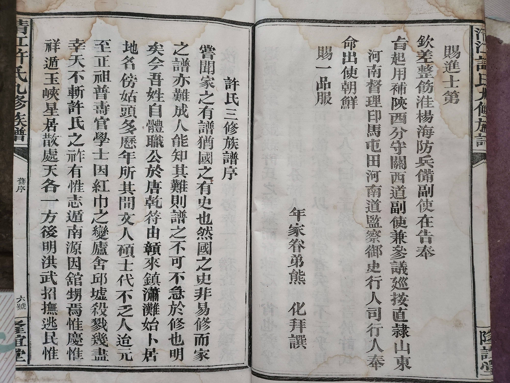
1. **江曰大傅施詩 → 江曰大傅施诗**  
   （江曰大傅所作之诗。）

2. **賜進士第 → 赐进士第**  
   （赐予进士的功名。）

3. **欽差整飭淮楊海防兵備副使在告奉旨起用 → 欽差整飭淮杨海防兵备副使，在告奉旨起用**  
   （钦差大臣整顿淮杨海防的兵备副使，因故在告，后奉旨重新起用。）

4. **補陝西分守關西道副使兼參議廵按直隸山東 → 补陕西分守关西道副使兼参议，巡按直隶山东**  
   （补任陕西分守关西道的副使并兼任参议，巡按直隶山东地区。）

5. **河南督理印馬屯田河南道監察御史行人司行人奉命出使朝鮮 → 河南督理印马屯田，河南道监察御史，行人司行人，奉命出使朝鲜**  
   （河南地区督理印马屯田事务的河南道监察御史，以及行人司的行人，奉命出使朝鲜。）

6. **賜一品服 → 赐一品服**  
   （赐予一品官服。）

7. **許氏三修族譜序 → 许氏三修族谱序**  
   （许氏家族第三次修订的族谱序言。）

8. **嘗聞家之有譜猶國之有史也 → 尝闻家之有谱，犹国之有史也**  
   （常听说家谱的重要性，就如同国家的历史一样。）

9. **然國之史非易修而家之譜亦難成人能知其難則譜之不可不急於修也 → 然国之史非易修，而家之谱亦难成。人能知其难，则谱之不可不急于修也**  
   （国家的历史不易修撰，家谱也难以编纂。人们若能明白其中的艰难，就知道家谱的修订刻不容缓。）

10. **明矣今吾姓自體職公於唐乾符由贑來鎮瀟灘始卜居地名傍姑頭 → 明矣，今吾姓自体职公于唐乾符年间，由贑地来镇潇滩，始卜居地名傍姑头**  
    （明白了，如今我们这一姓氏源自唐乾符年间的体职公，他从贑地来到镇潇滩，并在此地名为傍姑头的地方定居。）
## 旧序-七号
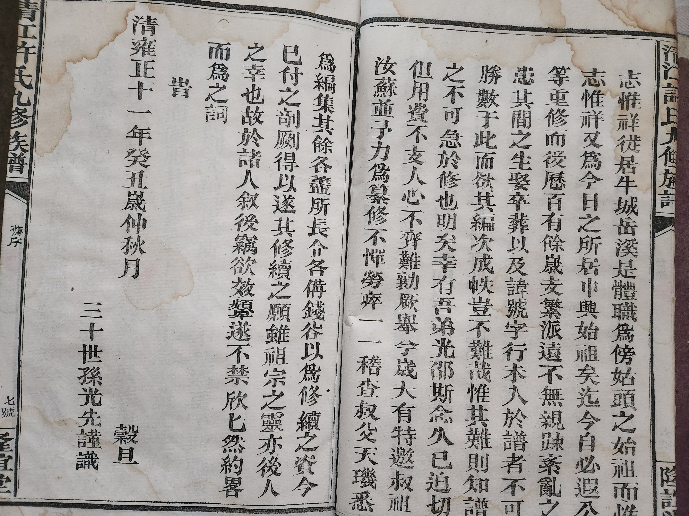
1. **志惟祥徙居牛城岳溪是體職爲傍姑頭之始祖而惟 → 志惟祥徙居牛城岳溪，是體職爲傍姑頭之始祖而惟**  
   （志惟祥迁居到牛城岳溪，是體職作为傍姑頭的始祖，而惟···）

2. **志惟祥又爲今日之所居中興始祖矣 → 志惟祥又为今日之所居中興始祖矣**  
   （···志惟祥又是今日所居住地的中兴始祖。）

3. **迄今自必遐公等重修而後厯百有餘嵗支繁派遠不無親踈紊亂之患 → 迄今自必遐公等重修而后历百有余岁，支繁派远，不无亲疏紊乱之患**  
   （至今自必遐公等人重修族谱后已过百余年，支系繁多，派别遥远，难免存在亲疏关系紊乱的问题。）

4. **今自必遐不勝數於此而欲其編次成帙豈不難哉 → 今自必遐不胜数于此，而欲其编次成帙，岂不难哉**  
   （如今自必遐的后代繁多，想要将其编次成册，岂不是很难。）

5. **惟其難則知譜之不可急於修也明矣 → 惟其难，则知谱之不可急于修也，明矣**  
   （正因为难，才知道族谱不能急于修订，这是显而易见的。）

6. **幸有吾弟光邵斯念久已迫切但用費不支人心不齊難勸厥舉 → 幸有吾弟光邵斯念久已迫切，但用费不支，人心不齐，难劝厥举**  
   （幸好有我的弟弟光邵长久以来迫切地想要修订，但费用不足，人心不齐，难以劝勉大家行动。）

7. **今嵗大有特邀叔祖汝蘇並尋力爲纂修不憚勞瘁一一稽查叔父天璣悉為編集 → 今岁大有，特邀叔祖汝苏并寻力为纂修，不惮劳瘁，一一稽查，叔父天玑悉为編集**  
   （今年收成大好，特别邀请叔祖汝苏并寻求助力进行纂修，不辞辛劳，一一稽查，叔父天玑也悉心进行编辑。）

8. **其餘各盖所長令各備錢穀以爲修續之資今巳付之剖劂得以遂其修續之願 → 其餘各盖所长，令各备钱谷以为修续之资，今已付之剞劂，得以遂其修续之愿**  
   （其余的人各展所长，命令大家各自准备钱财谷物作为修续的资金，现在已经交付刻印，得以实现修续的愿望。）

9. **雖祖宗之靈亦後人之幸也故於諸人叙後竊欲效顰遂不禁欣匕然約畧而爲之詞 → 雖祖宗之靈，亦後人之幸也，故於諸人叙后，竊欲效颦，遂不禁欣匕，然约畧而为之詞**  
   （这是祖宗的英灵，也是后人的幸运，所以在众人叙述之后，我私下里想要效仿，于是忍不住欣喜地，虽然简略但也写下了这些词句。）

10. **清雍正十一年癸丑嵗仲秋月 穀旦 三十世孫光先謹識 青工許氏九楊族譜 七號 → 清雍正十一年癸丑岁仲秋月 谷旦，三十世孙光先谨识，青工许氏九杨族谱，七号**  
    （清雍正十一年癸丑年仲秋月吉日，第三十世孙光先谨识，这是青工许氏的九杨族谱，编号为七号。）

## 旧序-八号
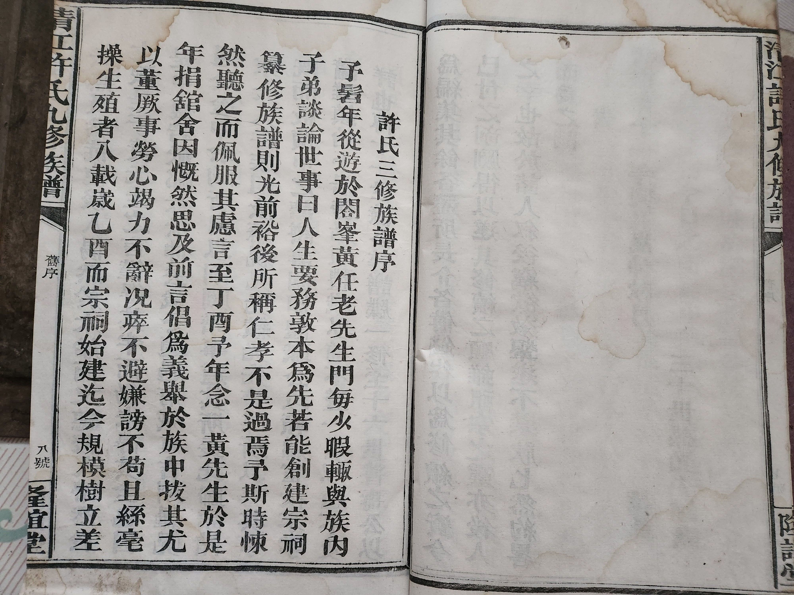
1. **許氏三修族譜序** → 许氏三修族谱序  
   （许氏家族第三次修订族谱的序言）

2. **予六年從遊於閣峯黃任老先生門每少暇輒與族內子弟談論世事曰人生要務敦本爲先若能創建宗祠纂修族譜則光前裕後所稱仁孝不是過焉** → 予六年从游于閣峯（闳峯）黃任老先生门每少暇辄与族内子弟谈论世事曰人生要务敦本为先若能创建宗祠纂修族谱则光前裕后所称仁孝不是过焉  
   （我六年前开始跟随閣峯（闳峯）的黄任老先生学习，每当有空闲时，就与族内的子弟谈论世事。他说人生的要务在于敦本，如果能创建宗祠、纂修族谱，那么就能光前裕后，所说的仁孝也不过如此）

3. **予斯時悚然聽之而佩服其慮言至丁酉予年念一黃先生於是年捐舘會因慨然思及前言倡爲義舉於族中拔其尤以董厥事勞心竭力不辭況瘁不避嫌謗不苟且絲毫操生殖者八載嵗乙酉而宗祠始建迄今規模樹立** → 予斯时悚然听之而佩服其虑言至丁酉予年念一黃先生於是年捐館舍因慨然思及前言倡为义举于族中拔其尤以董厥事劳心竭力不辞况瘁不避嫌谤不苟且丝毫操持（殖）者八载岁乙酉而宗祠始建迄今规模树立  
   （我当时悚然听之，非常佩服他的见解。到了丁酉年，我二十一岁时，黄先生在那一年捐出了他的馆舍，因此他感慨地想起了以前说的话，倡导在族中发起义举，选拔优秀的人才来负责这件事。他们劳心竭力，不辞辛劳，不避嫌谤，不苟且丝毫。经过八年的努力，岁乙酉时，宗祠终于开始建设，到现在规模已经树立）

4. **八號一量宜堂** → 八号一量宜堂  
   （可能是地点或宗祠内某部分的名称）

## 旧序-九号
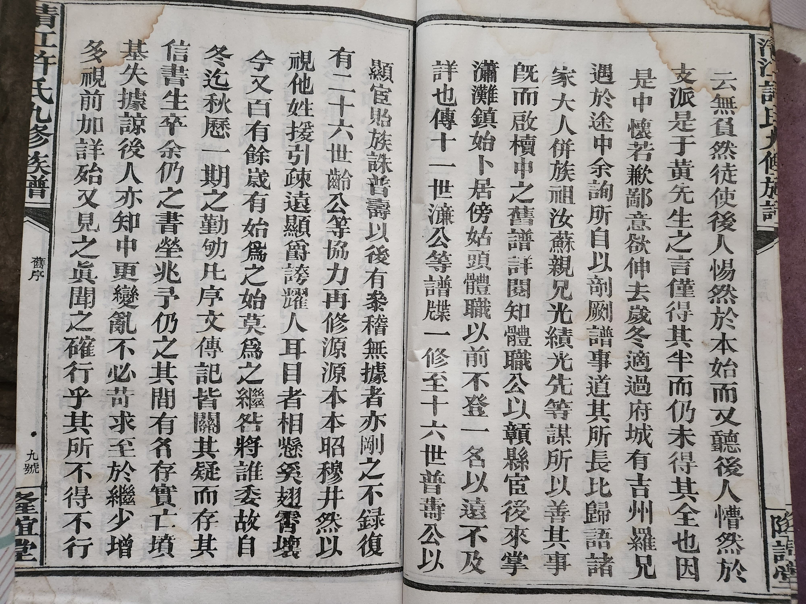
1. **雲無負然徒使後人惕然於本始 → 云无负然徒使后人惕然于本始**  
   （云无负然，只是让后人对本始感到警觉。）

2. **而又聽後人懵然於支派 → 而又听后人懵然于支派**  
   （却又让后人对支派感到茫然无知。）

3. **是於黃先生之言僅得其半而仍未得其全也 → 是于黄先生之言，僅得其半，而仍未得其全也**  
   （对于黄先生的话，只理解了一半，还没有完全领悟。）

4. **是中懷若歉鄙意欲伸去歲冬適過府城有吉州羅兄遇於途中 → 是中怀若歉鄙，意欲伸去歲冬，適過府城，有吉州羅兄遇於途中**  
   （心中怀有歉意，打算在去年冬天，经过府城时，遇到了吉州的罗兄在路上。）

5. **余詢所自以刻劂譜事道其所長 → 余詢所自，以刻劂譜事，道其所長**  
   （我询问他的来历，以及他刻印族谱的事情，他讲述了其中的长处。）

6. **比歸語諸家大人併族祖汝蘇親兄光緒光先等謀所以善其事 → 比歸，語諸家大人，併族祖汝蘇親兄光績光先等，謀所以善其事**  
   （回来后，我告诉家中的大人以及族祖汝苏亲兄光绩光先等人，共同谋划如何完善这件事。）

7. **既而啟楨中之舊譜詳圈知體職公以贑縣宦後來掌瀟灘鎮始卜居傍姑頭 → 既而啟櫝中之舊譜，詳閱知體職公，以贑縣宦後來掌瀟灘鎮，始卜居傍姑頭**  
   （之后打开柜子中的旧谱，详细阅读后得知体职公，以赣县官员的身份后来掌管潇滩镇，开始在那里定居。）

8. **體職以前不殘一名以遠不及詳也傳十一世瀛公等譜牒一修至十六世普壽公以顯宦貽族 → 體職以前，不登一名，以遠不及詳也。傳十一世濂公等，譜牒一修，至十六世普壽公，以顯宦貽族**  
   （体职公以前，没有记载一个人，因此不够详细。传到十一世濂公等，族谱进行了一次修订，到了十六世普寿公，因为显赫的官职而留给族人荣耀。）

9. **普壽以後有黍稽無據者亦剛之不録 → 普壽以後，有黍稽無據者，亦剛之不録**  
   （普寿公以后，有无法考证的人，也被刚正不阿地排除在记录之外。）

10. **復有二十六世齡公等協力再修源源本本昭穆井然 → 復有二十六世齡公等，協力再修，源源本本，昭穆井然**  
    （又有二十六世的龄公等人，协力再次修订族谱，使得族谱源源本本，昭穆关系井然有序。）

11. **今又白有餘嵗有始為之始莫為之繼咎將語委 → 今又百有餘歲，有始為之，始莫為之繼，咎將誰委**  
    （如今又过了百余年，有开始修订的人，却没有继续修订的人，责任应该归咎于谁呢？）

12. **故自冬迄秋厯一期之勤幼凡序文傳記皆關其疑而存其信書生卒余仍之書塋兆予仍之 → 故自冬迄秋，厯一期之勤勉，凡序文傳記，皆關其疑而存其信，書生卒，余仍之，書塋兆，予仍之**  
    （因此从冬天到秋天，经历了一期的勤勉努力，所有的序文和传记，都涉及其疑点但保留其可信之处，记录生卒年月，我仍然保留这些记录，也保留了书冢和兆头。）
## 旧序-十号
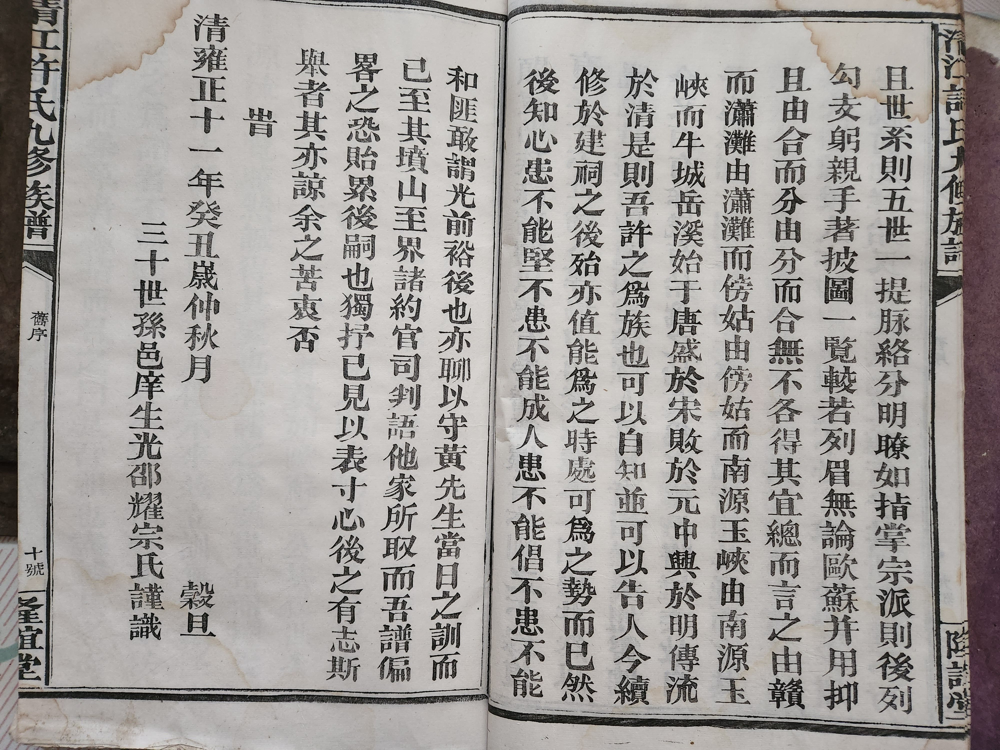

1. **且世系則五世一提脉絡分明瞭如指掌宗派則後列 → 且世系则五世一提，脉络分明，瞭如指掌，宗派则后列**  
   （且世系的记录是每五代一提，脉络清晰得如同亲眼所见，宗派则排列在后。）

2. **勾支躬親手著披圖一覽較若列眉無論歐蘇并用抑 → 勾支躬亲手著，披图一览，较若列眉，无论欧苏并用抑**  
   （勾支亲自撰写，翻阅图谱如同亲眼所见，清晰得如同排列在眼前，不论欧阳修与苏轼的并用还是其他。）

3. **且由合而分由分而合無不各得其宜總而言之由贛 → 且由合而分，由分而合，无不各得其宜，总而言之，由赣**  
   （且世系的发展有合有分，再由分转合，无不各得其所，总而言之，起源于赣。）

4. **而瀟灘由瀟灘而傍姑由傍姑而南源玉峽由南源玉 → 而潇滩由潇滩而傍姑，由傍姑而南源玉峡，由南源玉**  
   （而世系的流向是从潇滩到傍姑，再由傍姑到南源玉峡，起源于南源玉。）

5. **峽而牛城岳溪始于唐盛於宋敗於元中興於明傳流 → 峡而牛城岳溪，始于唐，盛于宋，败于元，中兴于明，传流**  
   （玉峡之后是牛城岳溪，始于唐朝，盛于宋朝，败于元朝，明朝时中兴，流传至今。）

6. **於清是則吾許之為族也可以自知並可以告人今續 → 于清，是则吾许之为族也，可以自知，并可以告人，今续**  
   （到了清朝，这就是我们许氏一族，可以自知，也可以告知他人，现在继续修撰。）

7. **修於建祠之後殆亦值能為之時處可為之勢而已然 → 修于建祠之后，殆亦值能为之时，处可为之势，而已然**  
   （修撰于建祠之后，大概也正值可以为之的时候，处于可以为之的形势，事情已成。）

8. **後知心患不能堅不患不能成人患不能倡不患不能 → 后知心患不能坚，不患不能成；人患不能倡，不患不能**  
   （后来人要知道，心志的忧患在于不能坚定，不在于不能成功；人的忧患在于不能倡导，不在于不能跟随。）

9. **和匪敢謂光前裕後也亦聊以守黃先生當日之訓而 → 和，匪敢谓光前裕后也，亦聊以守黄先生当日之训而**  
   （和谐共处，不敢妄言光宗耀祖，也只是姑且遵守黄先生当日的教诲。）

10. **已至其墳山至界諸約官司判語他家所取而吾譜偏 → 已至其坟山至界，諸約官司判語，他家所取，而吾譜偏**  
    （已至坟山的界限，各种契约官司的判决，他家所取，而我族的族谱却有所偏略。）

11. **畧之恐貽累後嗣也獨抒已見以表寸心後之有志斯 → 略之恐贻累后嗣也，獨抒己见以表寸心，后之有志斯**  
    （略去一些内容恐怕会连累后代，所以独自抒发己见以表达心意，希望后来有志于此的人能理解。）

12. **舉者其亦諒余之苦衷否 → 举者其亦谅余之苦衷否**  
    （做这件事的人，是否能体谅我的苦衷呢？）

13. **三十世孫邑庠生光邵耀宗氏謹識 → 三十世孙邑庠生光邵耀宗氏谨识**  
    （第三十世孙，邑庠生光邵耀宗氏恭敬地记录。）

14. **清雍正十一年癸北嵗仲秋月 穀旦 → 清雍正十一年癸丑岁仲秋月 谷旦**  
    （清雍正十一年癸丑年的仲秋之月，吉日。）
## 旧序-十一号
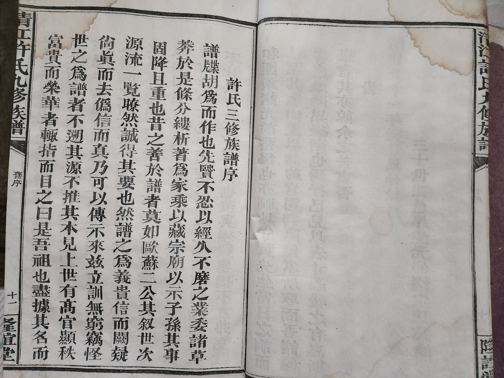
1. **許氏三修族譜序 → 许氏三修族谱序**  
   （许氏**第三次修订**族谱**的**序言**。）

2. **譜牒胡為而作也先賢不忍以經久不磨之業委諸草莽 → 谱牒胡为而作也，先贤不忍以经久不磨之业委诸草莽**  
   （谱牒**为何而作呢？先贤不忍心让这经久不衰的事业被埋没在**草莽**之中。）

3. **於是條分縷析著為家乘乘以藏宗廟以示子孫其事固降且重也 → 于是条分缕析著为家乘，用以藏宗庙以示子孙，其事固重大且庄严也**  
   （于是**条分缕析**地编写成**家谱**，用来存放在**宗庙**里展示给**子孙**，这件事确实重大且庄严。）

4. **昔之善於譜者莫如歐蘇二公其叙世次源流一覽瞭然誠得其要也 → 昔之善于谱者莫如欧苏二公，其叙世次源流一览瞭然，诚得其要也**  
   （过去**善于**编写**谱牒**的人莫过于欧阳修和苏洵两位先生，他们叙述世系和源流**一目了然**，确实抓住了要领。）

5. **然譜之為義貴信而闕疑尚真而去僞信而真乃可以傳示來茲立訓無窮竊怪世之為譜者不遡其源不推其本見上世有高官顯秩富貴而榮華者輒指而目之曰是吾祖也盡據其名而 → 然谱之为义贵信而阙疑，尚真而去伪，信而真乃可以传示来兹，立训无穷。窃怪世之为谱者，不溯其源，不推其本，见上世有高官显秩，富贵而荣华者，辄指而目之曰是吾祖也，尽据其名而**  
   （然而**谱牒**的意义在于**贵信而阙疑**，崇尚真实而去除虚假，真实可信才可以传给后代，作为永恒的训诫。我私下里奇怪那些编写谱牒的人，不追溯他们的**源头**，不推究他们的**根本**，看到上世有**高官显贵**，富贵荣华的人，就指着说这是我的祖先，完全根据他们的名字来认定。）
## 旧序-十二号
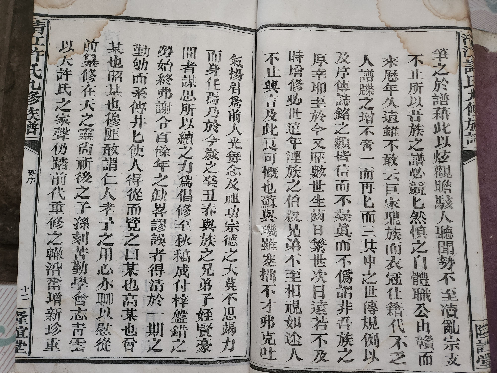
1. **筆之於譜藉此以炫觀瞻駭人聽聞勢不至瀆亂宗支 → 笔之于谱，藉此以炫观瞻，骇人听闻，势不至瀆亂宗支**  
   （将事迹记录于族谱中，借此展示家族荣耀，虽不至于引起惊骇听闻，但也不会扰乱宗族秩序。）

2. **不止所以吾族之譜必競匕然慎之自體職公由而來厯年久遠 → 不止所以，吾族之谱必竞匕然慎之，自體職公由而来，历年久远**  
   （正因如此，我们家族的族谱必须非常谨慎地编纂，它源自公职与体面，历经多年。）

3. **雖不敢云巨家鼎族而衣冠仕籍代不乏人 → 雖不敢云巨家鼎族，而衣冠仕籍代不乏人**  
   （虽不敢说我们是显赫的大族，但历代都有文人官员，不绝于人。）

4. **譜牒之增不啻一而再匕而三其中之世傳規例 → 谱牒之增，不啻一而再，匕而三，其中之世傳規例**  
   （族谱的增加，不止一次两次，而是多次，其中包含了世代相传的规矩和条例。）

5. **以及序傳誌銘之纇皆信而不疑眞而不僞 → 以及序傳誌銘之類，皆信而不疑，真而不僞**  
   （以及序传志铭之类的文字，都真实可信，没有虚假。）

6. **謂非吾族之厚幸耶至於今又歷數世生齒日無世次日遠 → 謂非吾族之厚幸耶？至於今，又歷數世，生齒日繁，世次日遠**  
   （这难道不是我们家族的幸运吗？到如今，又经历了数代，人口日益增多，世系也日益遥远。）

7. **若不及時墳修必世遠年湮族之伯叔兄弟不至相視如途人 → 若不及時增修，必世遠年湮，族之伯叔兄弟不至相視如途人**  
   （如果不及时增修族谱，世远年湮，族中的伯叔兄弟将不再相识，如同路人。）

8. **不止與言及此良可慨也與雖塞拙不才弗克吐氣揚眉 → 不止興言及此，良可慨也。與雖塞拙不才，弗克吐氣揚眉**  
   （不止于此，实在令人感慨。我虽然才疏学浅，不能扬眉吐气。）

9. **為前人光每念及祖功宗德之大莫不思竭力而身任焉 → 為前人光，每念及祖功宗德之大，莫不思竭力而身任焉**  
   （为了前人的荣耀，每当想到祖先的功德，无不思竭尽全力，亲自承担这一重任。）

10. **乃於今歲之癸丑春與族之兄弟子姪賢豪間者謀思所以績之力 → 乃於今歲之癸丑春，與族之兄弟子姪賢豪間者，謀思所以續之力**  
    （于是在今年癸丑之春，与族中的兄弟子侄及贤能之士商议，思考如何继续这一事业。）

11. **為倡修至秋稿成付梓盤錯之勞始終弗謝令百餘年之缺畧 → 為倡修，至秋稿成，付梓盤錯之勞，始終弗謝，令百餘年之缺略**  
    （我倡议修撰，到秋天稿子完成，付梓印刷的辛劳，始终未曾推辞，弥补了百余年来的缺失。）

12. **謬誤者得消於一期之勤劬而系傳井匕使人得從而覽之曰 → 謬誤者得消於一期之勤劬，而系傳井匕，使人得從而覽之，曰**  
    （谬误之处得以在一期的勤勉中消除，而世系得以传承，使人得以浏览，说道。）

13. **某也高某也曾某也昭某也穆匪敢謂仁人孝予之用心 → 某也高，某也曾，某也昭，某也穆，匪敢謂仁人孝子之用心**  
    （某人高尚，某人曾任要职，某人显赫，某人恭敬，不敢说是仁人孝子的用心。）

14. **亦聊以慰從前纂修在天之靈尚祈後之子孫刻苦勤學奮志靑雲 → 亦聊以慰從前纂修在天之靈，尚祈後之子孫刻苦勤學，奮志青雲**  
    （也姑且以此慰藉从前纂修族谱的在天之灵，还祈望后世的子孙能够刻苦勤学，奋发向上。）

15. **以天許氏之家聲仍踏前代重修之轍沿奮增新珍重十二塗宜堂 → 以大許氏之家聲，仍踏前代重修之轍，沿奮增新，珍重十二塗宜堂**  
    （以大许氏的家声为荣，继续沿着前代重修的轨迹，不断奋进创新，珍重十二塗宜堂。）
## 旧序-十三号
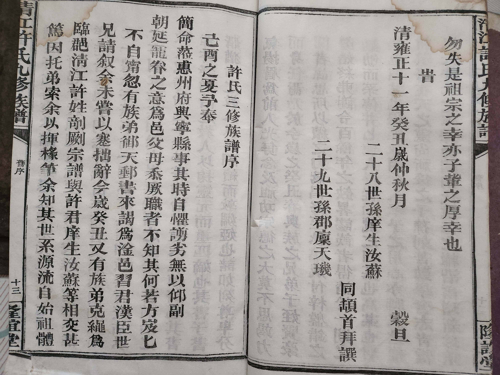
1. **勿失是祖宗之幸亦子輩之厚幸也 → 勿失是祖宗之幸，亦子辈之厚幸也**  
   （不要失去**是祖先的福气，也是**子孙**的福气。）

2. **清雍正十一年癸丑嵗仲秋月 → 清雍正十一年癸丑岁仲秋月**  
   （清雍正十一年癸丑年的仲秋月份。）

3. **穀旦 二十八世孫庠生汝蘇 → 谷旦，二十八世孙庠生汝苏**  
   （吉日，第二十八世孙庠生名为汝苏。）

4. **同頡首拜譔 → 同颉首拜撰**  
   （共同首肯并撰写。）

5. **二十九世孫郡廩天璣 → 二十九世孙郡廪天玑**  
   （第二十九世孙，郡廪生名为天玑。）

6. **許氏三修族譜序 → 许氏三修族谱序**  
   （许氏**第三次修订族谱的序言。）

7. **朝延寵眷之意為邑父母忝厥職者不知其何若方岌匕 → 朝廷宠眷之意，为邑父母忝厥职者，不知其何若，方岌岌**  
   （朝廷的恩宠之意，作为地方父母官的我们，不知道该如何应对，心中忐忑不安。）

8. **不自甯忽有族弟邠天郵書來謁為淦邑習君漢臣世 → 不自宁，忽有族弟邠天邮书来谒，为淦邑习君汉臣世**  
   （不料心中不宁，突然有族弟邠天来信拜访，是为了淦邑的习君汉臣世。）

9. **簡命蒞惠州府興寧縣事其時自懼谫劣無以仰副 → 简命莅惠州府兴宁县事，其时自惧谫劣，无以仰副**  
   （简命我到惠州府兴宁县任职，当时我自知才疏学浅，无法胜任。）

10. **兄請叙余未嘗以塞拙辭今歲癸丑又有族弟克繩為 → 兄长请叙余，未尝以塞拙辞，今岁癸丑，又有族弟克绳为**  
    （兄长请我撰写序言，我未曾以才疏学浅推辞，今年癸丑年，又有族弟克绳负责此事。）

11. **臨艷清江許姓剖剮宗譜與許君庠生汝蘇等相交甚 → 临清江许姓剖剮宗谱，与许君庠生汝苏等相交甚**  
    （临清江的许姓人家剖割宗谱，与庠生汝苏等人相交甚密。）

12. **篤因托弟案余以揮椽筆余知其世系源流自始祖體 → 笃因托弟，案余以挥椽笔，余知其世系源流自始祖体**  
    （因笃厚的情谊，托付给弟弟，我挥笔撰写，我知道他们的世系源流源自始祖。）
## 旧序-十四号
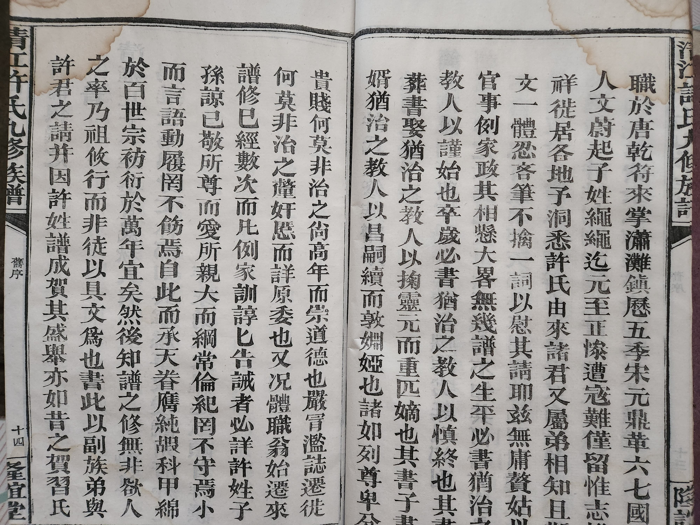
1. **職於唐乾符來掌瀟灘鎮厯五季宋元鼎革六七國 → 職於唐乾符來，掌瀟灘鎮，厯五季宋元，鼎革六七國**  
   （自唐朝乾符年间起，掌管潇滩镇，历经五代、宋、元，朝代更迭六七次。）

2. **人文蔚起子姓繩繩迄元至正遭宼難僅留惟志祥徙居各地 → 人文蔚起，子姓繩繩，迄元至正，遭寇難，僅留惟志祥，徙居各地**  
   （人文兴盛，子孙众多，直到元朝至正年间，遭遇寇难，仅留下惟志祥，他迁徙到各地。）

3. **予洞悉許氏由來諸君又屬弟相知且文一體忍吝筆不擒一詞以慰其請耶 → 予洞悉許氏由來，諸君又屬弟相知，且文一體，忍吝筆不擒一詞以慰其請耶**  
   （我深知许氏的由来，各位又是我的相知好友，况且文章风格一致，怎能吝啬笔墨不写一词来慰藉你们的请求呢？）

4. **兹無庸贅姑官事例家政其相懸大畧無幾譜之生平必書猶治 → 兹無庸贅，姑官事例，家政其相懸大畧無幾，譜之生平必書，猶治**  
   （此处无需赘述，暂且以官府事务为例，家政与之相差无几，族谱中生平事迹必须记录，如同治理国家一样重要。）

5. **教人以詳始也卒歲必書猶治之教人以愼終也其書 → 教人以詳始也，卒歲必書，猶治之教人以愼終也，其書**  
   （教导人要详细记录开始，年终也必须记录，如同治理国家一样教导人要谨慎结束，这些都要记录下来。）

6. **葬書娶猶治之教人以昌嗣續而敦嫻姬也諸如列尊卑分貴賤 → 葬書娶，猶治之教人以昌嗣續而敦嫻姬也，諸如列尊卑，分貴賤**  
   （葬礼和婚姻，如同治理国家一样教导人要昌盛后代并敦厚娴雅的女子，诸如列明尊卑等级，区分贵贱。）

7. **何莫非治之尙高年而崇道德也嚴冐濫誌遷徙 → 何莫非治之尙高年而崇道德也，嚴冐濫誌，遷徙**  
   （贵贱皆是治理国家所崇尚的高年长者并推崇道德，严格防止滥记迁徙之事。）

8. **何莫非治之釐奸慝而詳原委也又況體職翁始遷來 → 何莫非治之釐奸慝而詳原委也，又況體職翁始遷來**  
   （治理国家要厘清奸邪并详细记录原委，更何况体察到这位官员的迁徙。）

9. **譜修巳經數次而凡例家訓諄匕告誡者必詳許姓子孫 → 譜修巳經數次，而凡例家訓，諄匕告誡者必詳，許姓子孫**  
   （族谱已经修订多次，凡例家训中，谆谆告诫的内容必定详细，许姓子孙。）

10. **諒已敬所尊而愛所親大而綱常倫紀罔不守焉小而言語動履罔不飭焉 → 諒已敬所尊而愛所親，大而綱常倫紀罔不守焉，小而言語動履罔不飭焉**  
    （孙辈应当尊敬长辈并爱护亲人，大到纲常伦理无不遵守，小到言语行为无不规范。）

11. **自此而承天眷膺純嘏科甲綿於百世宗祊衍於萬年宜矣 → 自此而承天眷，膺純嘏，科甲綿於百世，宗祊衍於萬年，宜矣**  
    （从此承蒙天眷，获得纯嘏，科甲绵延百世，宗庙延续万年，这是适宜的。）

12. **然後知譜之修無非殺人之率乃祖攸行而非徒以具文為也 → 然後知譜之修，無非殺（疑为“率”之误）人之率，乃祖攸行，而非徒以具文為也**  
    （然后才知道修订族谱，无非是遵循祖先的教诲行事，而非仅仅为了形式。）

13. **書此以副族弟與許君之請并因許姓譜成賀其盛舉亦如昔之賀習氏 → 書此以副族弟與許君之請，并因許姓譜成，賀其盛舉，亦如昔之賀習氏**  
    （书写此序以回应族弟和许君的请求，并因许姓族谱修成而祝贺其盛举，如同昔日祝贺习氏一样。）
## 旧序-十五号

1. **者而俱撰之 → 者而俱撰之**  
   （此句较为独立，意为共同撰写。）

2. **清雍正十一年癸丑歲秋八月 → 清雍正十一年癸丑岁秋八月**  
   （清雍正十一年癸丑年的秋季八月**。）

3. **穀旦 賜進士第出身文林郎知興寧縣事改授饒州府外史 → 谷旦，赐进士第出身文林郎，知兴宁县事，改授饶州府外史**  
   （吉日，赐进士出身的文林郎，曾任兴宁县知县，后改授饶州府外史。）

4. **年家弟文水羅廷猷頡首拜譔 → 年家弟文水罗廷猷颉首拜撰**  
   （年家弟文水罗廷猷首肯并撰写。）

5. **許氏三修族譜序 → 许氏三修族谱序**  
   （许氏第三次修订的族谱序言**。）

6. **余家在宋為臨江人始不知為臨也既整次其故牒知 → 余家在宋为临江人，始不知为临也，既整次其故牒知**  
   （余家在宋朝时是临江人，起初不知，后来整理旧牒才得知。）

7. **以官籍居吾新者進士敬因公故系清江焉 → 以官籍居吾新者进士敬，因公故系清江焉**  
   （以官籍居住在吾新地的是进士敬，因公务原因与清江有关联。）

8. **廣寧廖公仕江南劉家始其嗣從母氏為黃實亦臨江人 → 广宁廖公仕江南刘家，始其嗣从母氏为黄实，亦临江人**  
   （广宁廖公在江南刘家做官，其后代从母氏姓黄，也是临江人。）

9. **今命訪其宗於清江未得也噫家譜之所關鉅矣或族繁而折處或時變而播遷至於宦遊四方開宗易氏幾世幾年不可稽考雖求其原委而傳紀失據至途人其親支大非崇 → 今命访其宗于清江未得也，噫，家谱之所关重大矣！或族繁而分支，或时变而迁徙，至于宦游四方，开宗易氏，几世几年不可稽考，虽求其原委而传记失据，至途人其亲支亦大非昔日之崇**  
   （如今命令寻访宗族于清江却未得，唉，家谱关系重大啊！或因家族繁盛而分支，或因时局变迁而迁徙，以至于宦游四方，改换宗族，几世几年都无法考证，即使寻求其原委，传记也缺乏依据，以至于路人对其亲支的尊崇也大不如前。）
## 旧序-十六号

无原图待修复
## 旧序-十七号
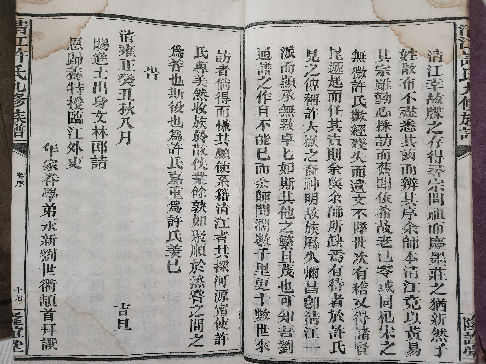
1. **消江幸故牒之存得尋宗問祖而廉墨莊之猶新然子 → 清江幸故牒之存得寻宗问祖而广墨庄之犹新然子**  
   （清江幸存的族谱，使得我们能够寻根问祖，广墨庄依然如新。）

2. **姓散布不盡悉其齒而辨其序余師本清江竟以黃易 → 姓散布不尽悉其齿而辨其序，余师本清江，竟以黄易**  
   （姓氏散布广泛，难以详尽了解其辈分而辨别其顺序，我的老师本是清江人，最终竟以黄易为名。）

3. **其宗雖勤心採訪而舊聞依希故老已零或同杞宋之 → 其宗虽勤心采访而旧闻依稀，故老已零落，或同杞宋之遗**  
   （其宗族虽然勤心采访，但旧闻已依稀难辨，故老也已零落，如同杞宋之遗民。）

4. **無微許氏數經殘失而遺文不墜世次有稽又得諸賢 → 无微许氏数经残失而遗文不坠，世次有稽，又得诸贤**  
   （无微许氏虽然多次经历残失，但遗文仍然流传，世系有据可查，又得诸贤相助。）

5. **昆遞起而任其責則余與余師所缺焉有待者於許氏 → 昆递起而任其责，则余与余师所缺，有待于许氏**  
   （昆仲递起而承担其责任，那么我与我的老师所缺的部分，还有待于许氏来补充。）

6. **見之傳稱許大嶽之裔神明故族厯久彌昌卽清江一 → 见之传称，许大岳之裔，神明故族，历久弥昌，即清江一**  
   （见之传称，许大岳的后裔，是神明般的故族，历久弥新，昌盛不衰，即清江一支。）

7. **派而顯承無斁卓匕如斯其他之繁且茂也可知吾劉 → 派而显承无斁，卓匕如斯，其他之繁且茂也，可知吾刘**  
   （这一支派显然传承无斁，卓越非凡，如此这般，其他支派也繁盛茂盛，由此可知吾刘一族。）

8. **通譜之作自不能巳而余師開潤數千里更十數世來 → 通谱之作自不能已，而余师开润数千里，更十数世来**  
   （通谱的编纂自然不能停止，而我的老师更是开润数千里，历经十数世而来。）

9. **為善也斯後也為許氏嘉重為許氏羡巳 → 为善也，斯役也，为许氏嘉重，为许氏美已**  
   （这是善举，也是使命，为许氏所嘉重，为许氏所美誉。）

10. **清雍正癸丑秋八月 → 清雍正癸丑秋八月**  
    （时间标注：清雍正癸丑年秋八月。）

11. **吉旦 → 吉旦**  
    （吉日。）

12. **賜進士出身文林郎請恩歸養特授臨江外吏 → 赐进士出身文林郎，请恩归养，特授临江外史**  
    （赐进士出身的文林郎，请求恩准归家奉养，特授临江外史之职。）

13. **年家眷學弟永新劉世衢頓首拜譔 → 年家眷学弟永新刘世衢顿首拜撰**  
    （年家眷学弟永新刘世衢，恭敬地顿首拜撰。）

14. **十七堂宜堂 重宜卷 → 十七堂（或指某一部分标识）宜堂，重宜卷（可能是指某一卷或篇章的标识）**  
    （十七堂之宜堂，重宜卷。）由于这部分信息较为模糊，具体含义可能需结合更多背景资料理解。
## 旧序-十八号
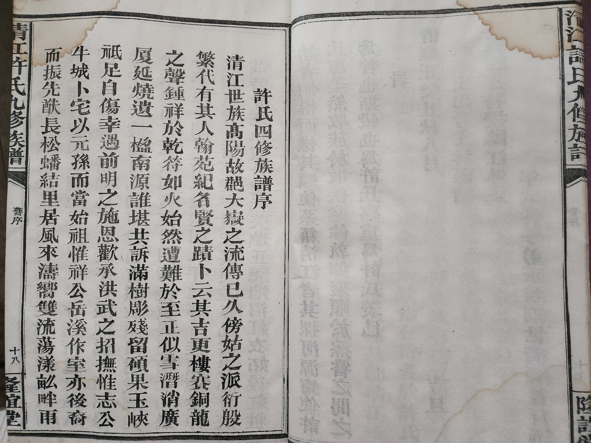
1. **許氏四修族譜序 → 許氏四修族谱序**  
   （許**xǔ氏第四次修订的族谱序言。）

2. **清江世族髙陽故絕大嶽之流傳已久 → 清江世族高陽故郡大岳之流傳已久**  
   （清江世族源自高陽故郡的大岳，其传承历史已久。）

3. **傍姑之派衍股 繁代有其人 → 傍始之派衍殷繁，代有其人**  
   （旁支派系繁衍众多，每一代都有杰出人物。）

4. **翰苑紀名賢之蹟 → 翰苑紀名賢之迹**  
   （翰苑中记载着名贤的事迹。）

5. **卜云其吉更樓賽銅龍 → 卜云其吉，更樓賽銅龍**  
   （占卜结果显示吉祥，更楼中有赛铜龙的景象。）

6. **之聲鍾祥於乾符如火始然遭難於至正似雪潛消 → 之声鍾祥於乾符如火，始然遭難於至正似雪潛消**  
   （其声在乾符年间如火焰般吉祥，却在至正年间遭遇灾难，如雪般潜藏消失。）

7. **廣厦延燒遺一楹南源誰堪共訴滿樹彫殘留碩果 → 廣厦延燒，遺一楹南源，誰堪共訴，滿樹彫殘，留碩果**  
   （广厦被烧毁，只留下一根柱子在南源，谁能共同诉说这满树的凋零，仅留下硕果。）

8. **玉峽祇足自傷幸遇前明之施恩歡承洪武之招撫 → 玉峽祇足自傷，幸遇前明之施恩，歡承洪武之招撫**  
   （玉峽只能独自哀伤，幸运的是遇到了前明的施恩，欢欣地承受了洪武时期的招抚。）

9. **惟志公牛城卜宅以元孫而當始祖惟祥公岳溪作室亦後裔 → 惟志公牛城卜宅，以元孫而當始祖，惟祥公岳溪作室，亦後裔**  
   （志公在牛城选址建宅，以元孙的身份成为始祖；祥公在岳溪建房，也是后裔。）

10. **而振先猷長松蟠結里居風來濤嚮雙流蕩漾 → 而振先猷，長松蟠結里居，風來濤響，雙流蕩漾**  
    （而振兴先祖的遗志，长松盘绕在居所周围，风吹来涛声阵阵，双流荡漾。）

11. **畝畔雨 → 畝畔雨**  
    （亩畔之雨。）
## 旧序-十九号

无 此处缺原图，待修复
## 旧序-二十号
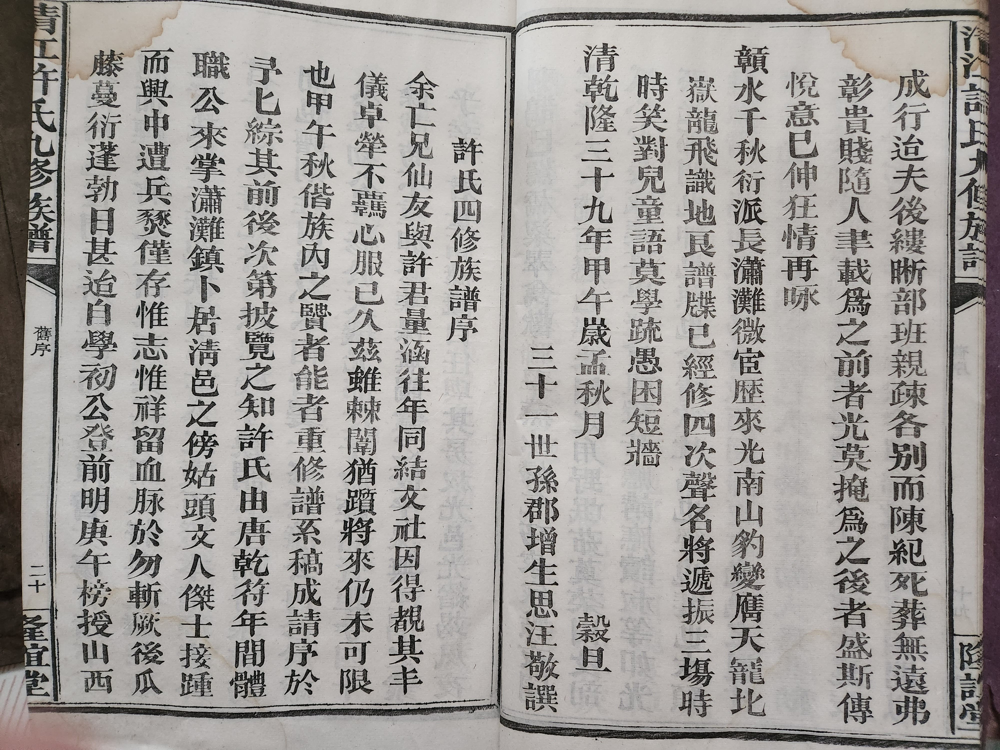
1. **成行迨夫後縷斷部班親疎各別而陳紀死葬無遺弗彰 → 成行迨夫后缕断部班亲疏各别而陈纪死葬无遗弗彰**  
   （排列成行，直到后代，血脉缕缕相连，亲疏有别，陈列记载生死葬事，无一遗漏，不被埋没。）

2. **貴賤隨人聿載爲之前者光莫掩爲之後者盛斯傳 → 贵贱随人聿载为之前者光莫掩为之后者盛斯传**  
   （贵贱随人记载，前人光辉不被掩盖，后人昌盛，代代相传。）

3. **悅意巳伸狂情再咏 → 悦意已伸狂情再咏**  
   （心意已舒展，豪情再咏叹。）

4. **許氏四修族譜序 → 许氏四修族谱序**  
   （许氏第四次修订族谱的序言。）

5. **余亡兄仙友與許君量涵 → 余亡兄仙友与许君量涵**  
   （我的亡兄仙友与许君量涵。）

6. **儀卓犖不羈心服已久 → 仪卓犖不羁心服已久**  
   （仪态卓绝不羁，我心服已久。）

7. **兹雖棘闈猶躓將來仍未可限 → 兹虽棘闱犹躓将来仍未可限**  
   （虽然在科举考试中受挫，但将来仍有无限可能。）

8. **時笑對兒童語莫學䟽愚困短牆 → 时笑对儿童语莫学疏愚困短墙**  
   （时常笑着对孩子们说，不要学那些疏忽愚笨的人，困在短墙中。）

9. **清乾隆三十九年甲午嵗孟秋月 → 清乾隆三十九年甲午岁孟秋月**  
   （清乾隆三十九年甲午年孟秋月。）

10. **三十一世孫郡增生思汪敬譔 → 三十一世孙郡增生思汪敬撰**  
    （三十一世孙郡增生思汪敬撰。）

11. **職公來掌瀟灘鎮卜居淸邑之傍姑頭文人傑士接踵而興 → 职公来掌潇滩镇卜居清邑之傍姑头文人杰士接踵而兴**  
    （职公来掌管潇滩镇，居住在清邑之旁，姑头文人杰士接踵而来，兴盛一时。）

12. **中遭兵燹僅存惟志惟祥留血脉於勿斬厥後瓜瓞綿綿 → 中遭兵燹仅存惟志惟祥留血脉于勿斩厥后瓜瓞绵绵**  
    （中途遭遇战乱，仅存的血脉是惟志惟祥，血脉延续不断，后代繁荣昌盛。）

13. **贑水千秋衍派長瀟灘微宦歷來光 → 赣水千秋衍派长潇滩微宦历来光**  
    （赣水千秋，衍派绵长，潇滩微宦，历来荣光。）

14. **南山豹變膺天寵北嶽龍飛識地良 → 南山豹变膺天宠北岳龙飞识地良**  
    （南山豹变，得天宠爱；北岳龙飞，识地优良。）

15. **也甲午秋偕族內之賢者能者重修譜系稿成請序於予 → 也甲午秋偕族内之贤者能者重修谱系稿成请序于予**  
    （也在甲午秋，与族内贤者能者重修谱系，稿成后请我作序。）
## 旧序-廿一
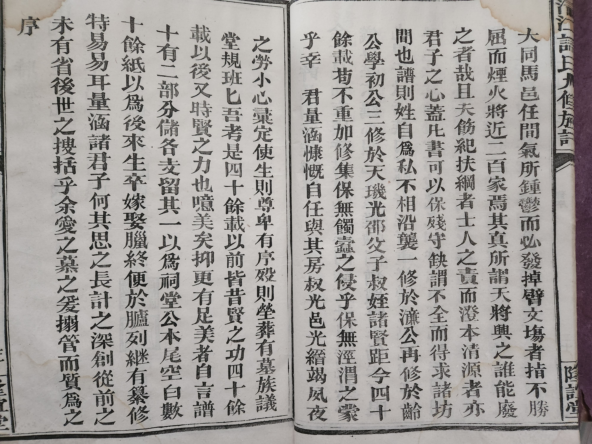
1. **大同馬邑任問氣所鈍鬱而必發掉臂文塲者指不勝屈 → 大同马邑任间气所钟郁而必发掉臂文场者指不胜屈**  
   （大同马邑地区的人才汇聚，其才情郁积到一定程度必然会展现出来，在文坛上大展身手的人不胜枚举。）

2. **煙火將近二百家焉其真所謂天將興之誰能廢之者哉 → 烟火将近二百家焉，其真所谓天将兴之，谁能废之者哉**  
   （烟火繁盛，将近二百户人家，这真正是上天要兴盛的地方，谁能废止它呢？）

3. **且夫飭紀扶網者士人之責而澄本清源者亦君子之心 → 且夫飭纪扶纲者士人之责，而澄本清源者亦君子之心**  
   （况且整治法纪、扶持纲常是士人的责任，而澄清本源、正本清源也是君子的心愿。）

4. **蓋凡書可以保殘守缺謂不全而得求諸坊間也 → 盖凡书可以保残守缺，谓不全而得求诸坊间也**  
   （大概凡是书籍，都可以保存残缺的部分，称之为不完整却能在书坊间找到。）

5. **譜則姓自爲私不相沿襲一修於公再修於齡公學初公三修於天璣光邵父子叔姪諸賢距今四十餘載 → 谱则姓自为私，不相沿袭，一修于瀆公，再修于龄公，学初公三修于天璣光邵父子叔姪诸贤，距今四十馀载**  
   （族谱则是各姓自家私修，不相沿袭，第一次修订于瀆公，第二次修订于龄公，学初公第三次修订于天璣光邵父子叔侄等诸位贤人，距今已经四十多年了。）

6. **不重加修集保無觸蠹之侵乎保無涇渭之蒙乎 → 不重加修集，保无触蠹之侵乎，保无涇渭之蒙乎**  
   （如果不重新加以修订整理，怎能保证不受蛀虫的侵蚀，怎能保证不被混淆呢？）

7. **幸君量涵慷慨自任與其房叔光邑光縉竭夙夜之勞小心彚定使生則尊卑有序殁則塋葬有墓族議堂規班匕 → 幸君量涵慷慨自任，与其房叔光邑光縉竭夙夜之劳，小心彚定，使生则尊卑有序，殁则塋葬有墓，族议堂规班匕**  
   （幸亏有位君子胸怀宽广，慷慨地承担起这项任务，与他的房叔光邑光縉等人夜以继日地辛劳，小心谨慎地修订整理，使得活着的人尊卑有序，死去的人有墓地安葬，族中的议事堂也有规矩法度。）

8. **吾考是四十餘載以前皆昔賢之功四十餘載以後又時賢之力也 → 吾考是四十餘载以前皆昔贤之功，四十餘載以來又時賢之力也**  
   （我考察这四十多年以前，都是前贤的功劳；四十多年以来，又是时贤的努力。）

9. **噫美矣抑更有足美者自言譜十有二部分儲各支留其一以爲祠堂公本 → 噫，美矣！抑更有足美者，自言谱十有二部分，储各支留其一以为祠堂公本**  
   （啊，真是美好啊！还有更值得赞美的地方，他们说族谱共有十二部分，各支保留一份，其中一份作为祠堂的公本。）

10. **尾空白數十餘紙以爲後來生卒嫁娶臘終便於臚列繼有纂修特易易耳 → 尾空白数十馀纸，以为后来生卒嫁娶臘终便于臚列，繼有纂修，特易易耳**  
    （谱尾留下空白数十页，以便将来记录生卒嫁娶年终等事宜，便于排列，以后若有修订，也特别容易。）
## 旧序-廿二
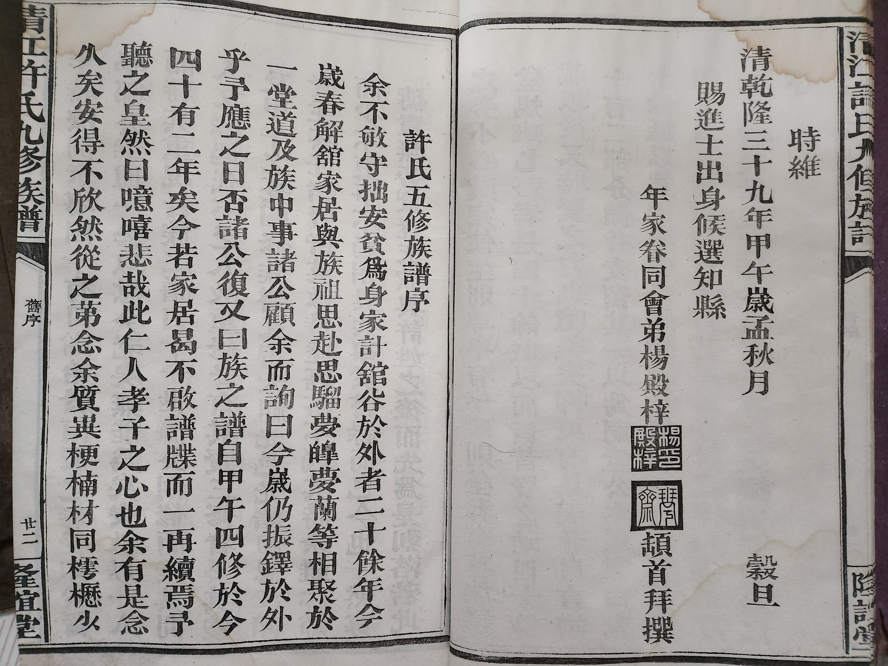
1. **淸乾隆三十九年甲午歲孟秋月 → 清乾隆三十九年甲午岁孟秋月**  
   （时间标注，意为清乾隆三十九年甲午年孟秋之月。）

2. **穀旦 → 谷旦**  
   （良辰吉日。）

3. **賜進士出身候選知縣 → 赐进士出身候补知县**  
   （身份说明，意为赐进士出身，候补知县。）

4. **楊印 首拜撰 → 杨印 首拜撰**  
   （作者署名，杨印撰写。）

5. **年家眷同會弟楊殿梓 → 年家眷同会弟杨殿梓**  
   （关系说明，意为同年家眷中的同会弟弟杨殿梓。）

6. **許氏五修族譜序 → 许氏五修族谱序**  
   （主题说明，许氏第五次修订的族谱序言。）

7. **余不敏守拙安貧為身家計 → 余不敏守拙安贫为身家计**  
   （自谦之词，意为我不聪明，守拙安贫，为家庭生计考虑。）

8. **館谷於外者二十餘年 → 馆谷于外者二十余年**  
   （经历说明，在外教书二十多年。）

9. **今嵗春解舘家居與族祀思赴思騖等相聚於一堂 → 今岁春解馆家居，与族祀思赴思騖等相聚于一堂**  
   （事件背景，今年春天解除书馆事务回家，与族中长辈相聚一堂。）

10. **道及族中事諸公顧余而詢曰今嵗仍振鐸於外乎 → 道及族中事，诸公顾余而询曰：今岁仍振铎于外乎？**  
    （对话内容，谈到族中事务，众人问我是否今年仍在外教书。）

11. **予應之日否 → 予应之日：否**  
    （我的回答，我回答说：没有。）

12. **諸公復又曰族之譜自甲午四修於今四十有二年矣 → 诸公复又曰：族之谱自甲午四修于今，四十有二年矣**  
    （继续对话，众人又说：族谱自甲午年第四次修订至今，已有四十二年。）

13. **今若家居曷不啟譜牒而一再續焉 → 今若家居，曷不启谱牒而一再续焉**  
    （提议续修，现在如果在家，何不打开族谱再次续修呢？）

14. **予聽之皇然曰噫嘻悲哉此仁人孝子之心也 → 予听之恍然曰：噫嘻！悲哉！此仁人孝子之心也**  
    （我的感悟，我听后恍然大悟说：啊！可悲啊！这是仁人孝子的心意啊！）

15. **余有是念久矣安得不欣然從之 → 余有是念久矣，安得不欣然从之**  
    （我的决定，我有这个想法很久了，怎能不欣然从命呢？）

16. **弟念余質異梗楠材同樗櫟少 → 弟念余质异梗楠材同樗栎少**  
    （弟弟的想法，弟弟认为我质地不同于梗楠，却像樗栎一样少才。）

17. **許氏九參族普廿二隆宜堂 → 许氏九参族谱，廿二隆宜堂**  
    （可能是关于许氏参与修谱或族谱存放地点的信息，许氏第九次参与修订族谱，存放在廿二隆宜堂。）
## 旧序-廿三
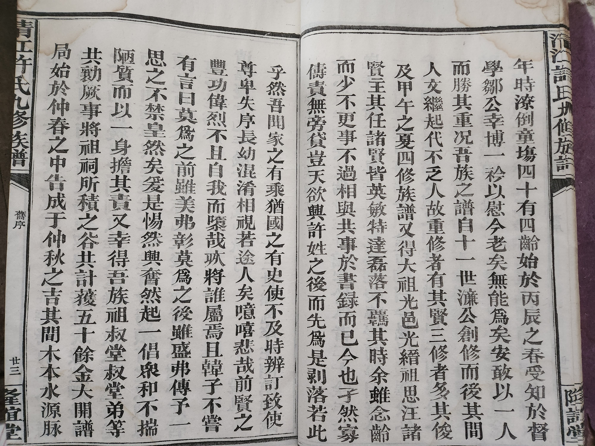
1. **年時涼例童塲四十有四齡始於丙辰之春受知於督學鄒公幸博一矜以慰今老矣無能爲矣 → 年时潦倒童场四十有四龄始于丙辰之春受知于督学邹公幸博一衿以慰今老矣无能为矣**  
   （年岁不佳，童子试时我已四十四岁，自丙辰年春天受督学邹公赏识，侥幸获得秀才身份以自慰，如今已老，无能为力。）

2. **安敢以一人而勝其重況吾族之譜自十一世濓公創修而後其間人文繼起代不乏人故重修者有其賢三修者多其俊 → 安敢以一人而胜其重，况吾族之谱自十一世濂公创修而后，其间人文继起，代不乏人，故重修者有其贤，三修者多其俊**  
   （怎敢以一人之力承担如此重任，况且我族族谱自十一世濂公开始修订，之后人文辈出，代代都有杰出人才，所以重修时有贤能之人，三修时更是英才济济。）

3. **及甲午之夏四修族譜又得大祖光邑光緒祖思汪諸賢主其任諸賢皆英敏特達磊落不羈其時余雖念齡而少不更事不過相與共事於書録而已 → 及甲午之夏四修族谱，又得大祖光邑、光绪祖思汪诸贤主其任，诸贤皆英敏特达，磊落不羁，其时余虽念龄而少不更事，不过相与共事于书录而已**  
   （到甲午年夏天第四次修订族谱时，又有大祖光邑、光绪祖思汪等贤能之人主持其事，这些贤人都聪明敏捷，品德高尚，不拘小节，当时我虽然因年纪尚轻而缺乏经验，但也只是与他们一起从事文字记录工作。）

4. **今也孑然寡儔責無旁貸豈天欲興許姓之後而先為是落若此乎 → 今也孑然寡俦，责无旁贷，岂天欲兴许姓之后而先为此剥落若此乎**  
   （如今我孤身一人，责任重大，无旁人可分担，难道是天意要兴盛许姓的后代，却先让族谱如此破败吗？）

5. **然吾聞家之有乘猶國之有史使不及時辨訂致使尊卑失序長幼混淆相視若途人矣 → 然吾闻家之有乘，犹国之有史，使不及时辨订，致使尊卑失序，长幼混淆，相视若途人矣**  
   （然而我听说家族有族谱，就像国家有历史一样，如果不及时修订，就会导致尊卑失序，长幼不分，彼此相见如同陌路人。）
## 旧序-廿四
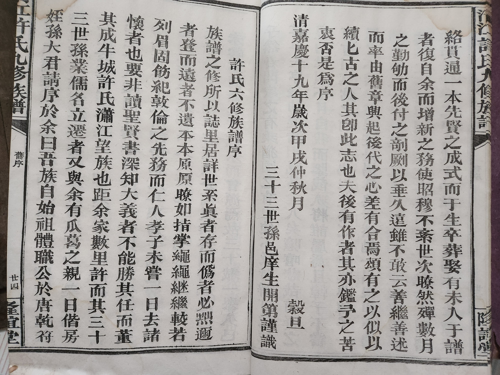
1. **絡貫通一木先賢之成式而于生卒葬娶有未人于譜者復自余而增新之 → 絡贯通一木先賢之成式，而于生卒葬娶有未人于譜者，復自余而增新之**  
   （继承先贤的成规，对于生卒葬娶等未入族谱者，再由我增添新的内容。）

2. **務使昭穆不棄世次瞭然殫數月之勤劬而後付之剞劂以垂久遠 → 務使昭穆不棄，世次瞭然，殫數月之勤劬，而後付之剞劂，以垂久遠**  
   （务必使昭穆（宗法制度）不乱，世系清晰，经过数月的辛勤努力，然后才付梓印刷，以流传久远。）

3. **雖不敢云善繼善述而率由舊章興起後代之心差有合焉 → 雖不敢云善繼善述，而率由舊章，興起後代之心，差有合焉**  
   （虽然不敢说能很好地继承并传述，但遵循旧章，兴起后代之心，大致相合。）

4. **頌有之以似以續匕古之人其卽此志也夫後有作者其亦鑑予之苦衷否 → 頌有之以似，以續匕古之人，其卽此志也夫。後有作者，其亦鑑予之苦衷否**  
   （歌颂它以此延续古人的志向，这就是我的志向。后有作者，或许也能鉴察我的苦衷吧。）

5. **清嘉慶十九年歲次甲戌仲秋月穀旦 → 清嘉慶十九年歲次甲戌仲秋月穀旦**  
   （清嘉庆十九年岁次甲戌仲秋月的吉日。）

6. **三十三世孫邑庠生開第謹識 → 三十三世孫邑庠生開第謹識**  
   （三十三世孙、邑庠生（地方学校的生员）开第谨识。）

7. **許氏六修族譜序 → 许氏六修族谱序**  
   （许氏第六次修订的族谱序言。）

8. **族譜之修所以誌里居詳世系眞者存而僞者必黜 → 族譜之修，所以誌里居，詳世系，眞者存而僞者必黜**  
   （修订族谱，是为了记录居住地，详细世系，真实者留存，虚假者必除。）

9. **邇者登而遺者不遺本本原原瞭如指掌 → 邇者登，而遺者不遺，本本原原，瞭如指掌**  
   （近者登录，而遗漏者不遗漏，原原本本，了如指掌。）

10. **繩繩繼繼較若列眉固飭紂敦倫之先務 → 繩繩繼繼，較若列眉，固飭紂（此处“紂”疑为“飾”之误）敦倫之先務**  
    （纷纷继继，较若列眉，整饬伦理道德，是首要任务。）

11. **仁人孝子未嘗一日去諸懷者也要非讀聖賢書深知大義者不能勝其任而董其成 → 仁人孝子未嘗一日去諸懷者也，要非讀聖賢書深知大義者，不能勝其任而董其成**  
    （仁人孝子未尝一日离开这些（伦理道德），只有读圣贤书、深知大义的人，才能胜任其职责并主持其事。）
## 旧序-廿五
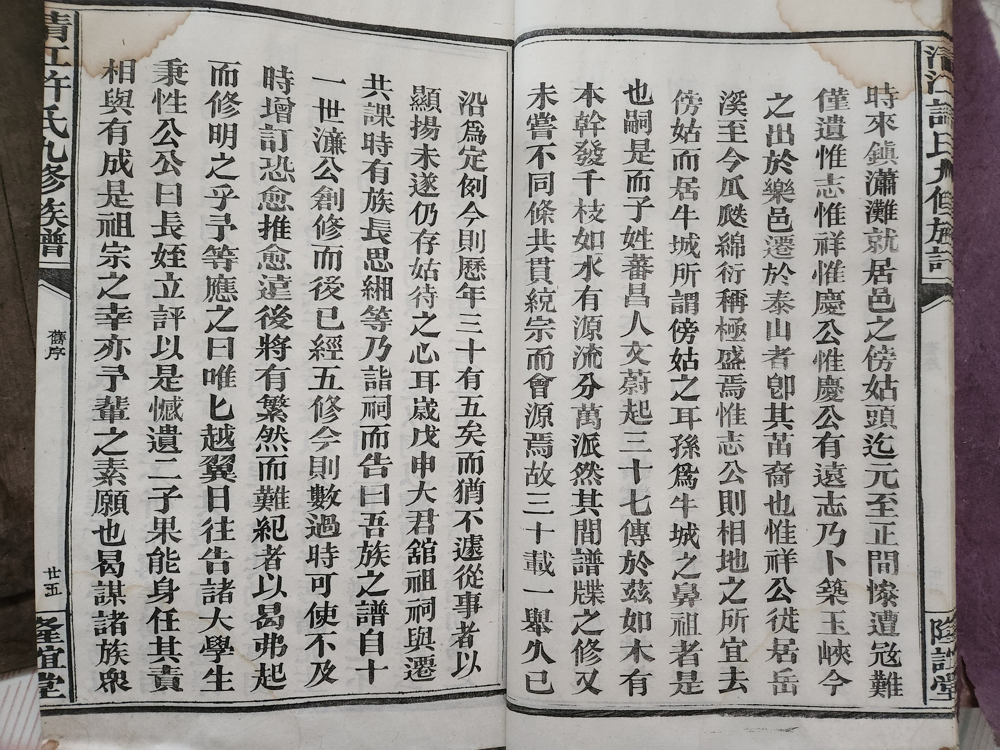
1. **時來鎮瀟灘就居邑之傍姑頭迄元至正問遭宼難 → 時來鎮瀟灘，就居邑之傍姑頭，迄元至正間，遭寇難**  
   （时运来到瀟灘，于是在邑之傍姑頭定居，直到元至正年间，遭遇寇难。）

2. **僅遺惟志惟祥惟慶公 → 僅遺惟志、惟祥、惟慶公**  
   （仅留下惟志、惟祥、惟慶公。）

3. **惟慶公有遠志乃卜築玉峽今 → 惟慶公有遠志，乃卜築玉峽（今地）**  
   （惟慶公有远大志向，于是选择在玉峽定居。）

4. **之出於樂邑遷於泰山者卽其苗裔也 → 之出於樂邑，遷於泰山者，卽其苗裔也**  
   （从乐邑迁徙到泰山的人，就是他们的后代。）

5. **惟祥公徙居岳溪至今瓜瓞綿衍稱極盛焉 → 惟祥公徙居岳溪至今，瓜瓞綿衍，稱極盛焉**  
   （祥公迁居岳溪至今，后代繁衍，极为兴盛。）

6. **惟志公則相地之所宜去傍姑而居牛城所謂傍姑之耳孫為牛城之鼻祖者是也 → 惟志公則相地之所宜，去傍姑而居牛城，所謂傍姑之耳孫，為牛城之鼻祖者是也**  
   （惟志公选择适宜的地方，离开傍姑而居住在牛城，所谓傍姑的耳孙，就是牛城的始祖。）

7. **嗣是而子姓蕃昌人文蔚起三十七傳於茲如木有本幹發千枝如水有源流分萬派然 → 嗣是而子姓蕃昌，人文蔚起，三十七傳於茲，如木有本幹發千枝，如水有源流分萬派然**  
   （从此子孙繁盛，人文昌盛，三十七代传承至今，如同树木有主干分出千枝，如同水流有源头分出万派。）

8. **未嘗不同條共貫統宗而會源焉 → 未嘗不同條共貫，統宗而會源焉**  
   （从未不是同一条主线贯穿，汇聚宗族于源头。）

9. **故三十載一舉久已沿為定例 → 故三十載一舉，久已沿為定例**  
   （所以每三十年修订一次，已经成为定例。）

10. **今則厯年三十有五矣而猶不遽從事者以顯揚未遂仍存姑待之心耳 → 今則厯年三十有五矣，而猶不遽從事者，以顯揚未遂，仍存姑待之心耳**  
    （现在已经过了三十五年，却还没有着手修订，是因为显扬未遂，仍存等待之心。）

11. **嵗戌申大君舘祖祠與遷共課時有族長思緗等乃詣祠而告曰 → 歲戊申，大君舘祖祠，與遷共課時，有族長思綱等乃詣祠而告曰**  
    （岁戊申，大君在祖祠与族人共课时，有族长思綱等来到祠堂告曰。）

12. **吾族之譜自十一世濂公創修而後已經五修今則數過時可使不及而增訂之乎 → 吾族之譜，自十一世濂公創修而後，已經五修，今則數過時，可使不及而增訂之乎**  
    （我族的族谱，自十一世濂公创修之后，已经五修，现在时间已过，难道能让它不及时而增订吗？）

13. **予等應之曰唯匕越翼日往告諸大學生秉性公公曰長姪立評以是憾遺二子果能身任其責相與有成是祖宗之幸亦予輩之素願也 → 予等應之曰：“唯。”匕越翼日，往告諸大學生。秉性公公曰：“長姪立評以是憾遺，二子果能身任其責，相與有成，是祖宗之幸，亦予輩之素願也。”**  
    （我们回答说：“是。”第二天，去告诉各位大学生。秉性公公说：“长姪立评以此为憾，两个儿子果然能承担责任，共同有所成就，这是祖宗的幸运，也是我们辈分的愿望。”）

14. **曷謀諸族衆青工许氏九务族普舊序 → 曷謀諸族衆？秉性公公曰（此處可能有遺漏，但基於現有信息解讀）**  
    （如何谋划于族人？秉性公公说……）**注**：此句因信息不完整，仅根据现有内容解读。

（注：以上回答中，对于原文中识别不清或可能存在的遗漏部分，已尽量根据上下文和常识进行合理推测和补充。）
## 旧序-廿七
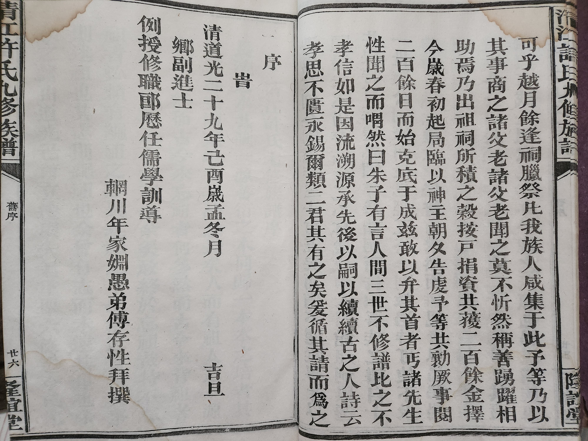
1. **可乎越月餘逢祠臘祭凡我族人咸集于此 → 可乎越月余逢祠腊祭，凡我族人咸集于此**  
   （或许在月余之后遇到祠堂的腊祭，我们所有族人都会聚集在这里。）

2. **予等乃以其事商之諸父老請父老聞之莫不忻然稱善 → 予等乃以其事商之诸父老，请父老闻之莫不忻然称善**  
   （我们便将此事与各位父老商议，父老们听后无不欣然称善。）

3. **踴躍相助焉乃出祖祠所積之穀按戸捐資共獲二百餘金 → 踊跃相助焉，乃出祖祠所积之谷，按户捐资，共获二百余金**  
   （大家踊跃相助，于是拿出祖祠积存的谷物，按户捐资，共获得二百余金。）

4. **擇今嵗春初起局臨以神主朝久告虔予等共勳厥事 → 擇今岁春初起局，临以神主，朝夕告虔，予等共勋厥事**  
   （选择今年春初开始筹备，在神主前朝夕告祭，我们共同勤勉地完成此事。）

5. **閱二百餘日而始克底于成兹敢以弁其首者丐諸先生 → 阅二百余日而始克底于成，兹敢以弁其首者，丐诸先生**  
   （经过二百余日才最终完成，现在敢于将这篇序言放在卷首，乞请诸位先生。）

6. **性聞之而喟然曰朱子有言人間三世不修譜比之不孝 → 性闻之而喟然曰：朱子有言，人间三世不修谱，比之不孝**  
   （性先生听闻后长叹道：朱子曾说，人间三代不修家谱，就如同不孝。）

7. **信如是因流溯源承先後以嗣以續續古之人 → 信如是，因流溯源，承先后以嗣，以续续古之人**  
   （确实如此，因此要追溯源流，继承先辈的传统，以延续古人的血脉。）

8. **詩云孝思不匱永錫爾類二君其有之矣 → 诗云：孝思不匮，永锡尔类。二君其有之矣**  
   （诗经说：孝思不断，永远赐福于你的同类。两位君子大概就是这样的人吧。）

9. **清道光二十九年己酉嵗孟冬月吉旦 → 清道光二十九年己酉岁孟冬月吉旦**  
   （清道光二十九年己酉年孟冬月的吉日。）

10. **鄉副進士例授修職郎厯任儒學訓導 川年家婣愚弟傅存性。拜撰 → 乡副进士例授修职郎，历任儒学训导，川年家眷愚弟傅存性拜撰**  
    （乡副进士按例授予修职郎的官职，历任儒学训导，川地同年家属的愚弟傅存性恭敬地撰写。）
## 旧序-廿七
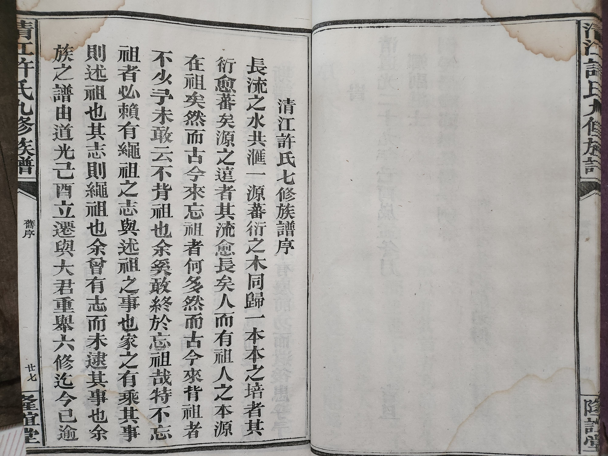
1. **清江許氏七修族譜序 → 清江许氏七修族谱序**  
   （清江许氏第七次修订的族谱序言。）

2. **長流之水共滙一源 → 长流之水共汇一源**  
   （长流之水共同汇聚于一个源头。）

3. **蕃衍之本同歸一本 → 蕃衍之本同归一本**  
   （繁衍的根本都回归于一个源头。）

4. **本本之培者其衍愈蕃矣 → 本本之培者，其衍愈蕃矣**  
   （根本的培养者，其后代愈发繁盛。）

5. **源之遠者其流愈長矣 → 源之远者，其流愈长矣**  
   （源头越远，其水流越长。）

6. **人而有祖人之本源在祖矣 → 人而有祖，人之本源在祖矣**  
   （人有祖先，人的本源在于祖先。）

7. **然而古今來忘祖者何多 → 然而古今来，忘祖者何多**  
   （然而古往今来，忘记祖先的人很多。）

8. **然而古今來背祖者不少 → 然而古今来，背祖者不少**  
   （然而古往今来，背叛祖先的人也不少。）

9. **余奚敢終於忘祖哉 → 余奚敢终于忘祖哉**  
   （我怎敢最终忘记祖先呢？）

10. **特不忘祖者必賴有繩祖之志 → 特不忘祖者，必赖有绳祖之志**  
    （特别是不忘祖先的人，必定依赖有继承祖先志向的心。）

11. **與述祖之事也家之有乘其事 → 与述祖之事也，家之有乘，其事**  
    （与叙述祖先的事迹相关，家有族谱记载此事。）

12. **則述祖也其志則繩祖也 → 则述祖也，其志则绳祖也**  
    （则是叙述祖先，其志向则是继承祖先。）

13. **余曾有志而未逮其事也 → 余曾有志，而未逮其事也**  
    （我曾经有志向，但未能完成这件事。）

14. **余族之譜由道光己酉立遷與大君重舉六修 → 余族之谱，由道光己酉立，遷與大君重举六修**  
    （我的族谱，从道光己酉年开始修订，遷與大君主持了第六次修订。）

15. **迄今已逾廿七宜堂青工許氏九參普序 → 迄今已逾廿七，宜堂（此处可能识别有误或信息缺失），许氏九参普序（此处可能指另一版本或修订的序言）**  
    （至今已超过二十七年，关于宜堂（信息可能不完整），许氏的某次修订序言。）
## 旧序-廿八
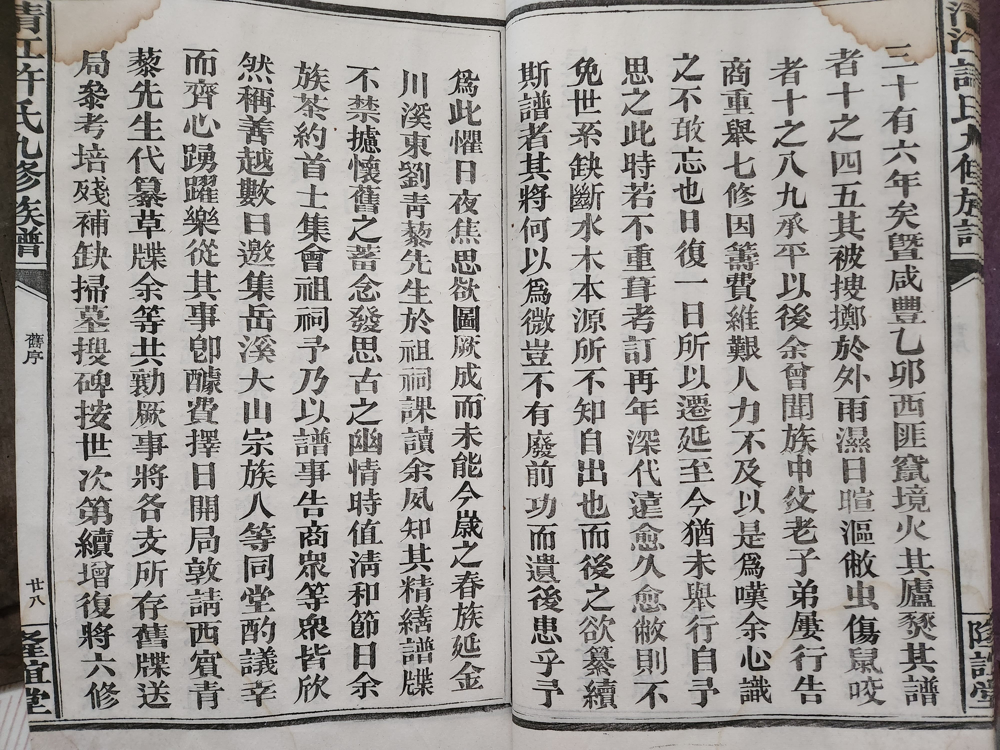
1. **三十有六年矣暨咸豐乙卯西匪竄境火其廬燹其譜 → 三十有六年矣，暨咸丰乙卯，西匪窜境，火其庐，燹其谱**  
   （已经三十六年了，到了咸丰乙卯年，西匪窜入境内，烧毁房屋，焚毁族谱。）

2. **黎其譜者十之四五其被搜擲於外雨濕日暄漚敝蟲傷鼠咬者十之八九 → 燹其谱者十之四五，其被搜掷于外，雨湿日暄，沤敝虫伤鼠咬者十之八九**  
   （被焚毁的族谱有十分之四五，那些被搜出来扔到外面的，又因为雨淋日晒，变得破旧，被虫咬鼠啃的又有十分之八九。）

3. **承平以後余曾聞族中父老子弟屢行告商重舉七修 → 承平以后，余曾闻族中父老子弟屡行告商，重举七修**  
   （太平时期以后，我曾听说族中的父老和子弟多次商议，想要重新举行第七次修订族谱。）

4. **因籌費維艱人力不及以是為嘆余心識之不敢忘也 → 因筹费维艰，人力不及，以是为叹，余心识之，不敢忘也**  
   （但因为筹集经费困难，人力也不足，所以大家都感叹，我心里明白这件事，不敢忘记。）

5. **日复一日所以遷延至今猶未舉行自予思之 → 日复一日，所以迁延至今，犹未举行，自予思之**  
   （日复一日，所以拖延到现在还没有举行，我自己思考这件事。）

6. **此時若不重耳考訂再年深代遠愈久愈敝則不免世系缺斷 → 此时若不重耳考订，再年深代远，愈久愈敝，则不免世系缺断**  
   （此时如果不重新考订，随着时间流逝，年代久远，情况会越来越糟，那么世系就难免会断绝。）

7. **水木本源所不知自出也而後之欲纂續斯譜者 → 水木本源所不知，自出也，而后之欲纂续斯谱者**  
   （就像不知道自己的本源出自哪里，那么后来想要编纂这部族谱的人。）

8. **其將何以為徵豈不有廢前功而遺後患乎予為此懼 → 其将何以为征，岂不有废前功而遗后患乎？予为此惧**  
   （他们将凭什么作为证据呢？难道不会白费前面的功夫，而留下后患吗？我为此感到恐惧。）

9. **日夜焦思欲圖厥成而未能今歲之春族延金川溪東劉青藜先生於祖祠課讀 → 日夜焦思，欲图厥成，而未能。今岁之春，族延金川溪东刘青藜先生于祖祠课读**  
   （日夜焦虑思考，想要完成这件事，但没能成功。今年春天，族里聘请了金川溪东的刘青藜先生在祖祠授课。）

10. **余夙知其精繕譜牒不禁攄懷舊之蓄念發思古之幽情 → 余夙知其精缮谱牒，不禁摭怀旧之蓄念，发思古之幽情**  
    （我向来知道他擅长编纂族谱，不禁勾起怀旧的念头，引发对古代的幽思。）

11. **時值清和節日余族茶約首士集會祖祠予乃以譜事告商衆等 → 时值清和节日，余族茶约首士集会祖祠，予乃以谱事告商众等**  
    （正值清明和煦的节日，我们族人相约在祖祠集会，我便把修订族谱的事情告诉大家商议。）

12. **衆皆欣然稱善越數日邀集岳溪大山宗族人等同堂酌議 → 众皆欣然称善，越数日，邀集岳溪大山宗族人等同堂酌议**  
    （大家都很高兴地表示赞同，过了几天，又邀请岳溪大山的宗族人等同堂商议。）

13. **幸而齊心踴躍樂從其事卽醵費擇日開局敦請西賓青黎先生代纂草牒 → 幸而齐心踊跃，乐从其事，即醵费择日开局，敦请西宾青黎先生代纂草牒**  
    （幸运的是大家齐心协力，踊跃参与，于是筹集经费，选定日期开局，恭敬地聘请西宾青黎先生代为编纂草稿。）

14. **余等共勸厥事將各支所存舊牒送局叅考培殘補缺 → 余等共劝厥事，将各支所存旧牒送局参考，培残补缺**  
    （我们共同劝勉此事，将各支所保存的旧族谱送到局里参考，修补残缺。）

15. **掃墓搜碑按世次第續增復將六修廿八宜堂青工許氏九參族普序 → 扫墓搜碑，按世次第续增，复将六修廿八宜堂青工许氏九参族谱序**  
    （扫墓搜寻碑文，按照世系依次续增，又重新整理了第六次修订的廿八宜堂青工许氏的九参族谱序。）
## 旧序-廿九
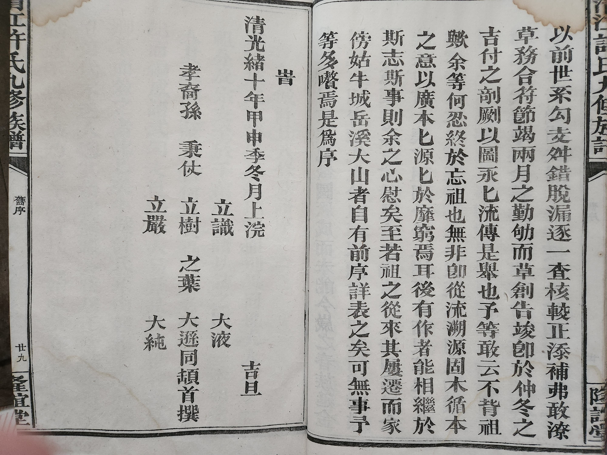
1. **以前世系勾支舛錯脫漏逐一查核較正添補弗敢潦草務合符節竭兩月之勤劬而草創告竣 → 以前世系勾支舛错脱漏逐一查核较正添补弗敢潦草务合符节竭两月之勤劬而草创告竣**  
   （对以前世系的错误、遗漏进行逐一核查、校正、补充，不敢潦草，力求符合事实，经过两个月的辛勤努力，终于完成初稿。）

2. **即於仲冬之吉付之剞劂以圖永匕流傳 → 即于仲冬之吉付之剞劂以图永匕流传**  
   （于是在农历十一月吉日，将其付梓印刷，以求永久流传。）

3. **是舉也予等敢云不背祖歟 → 是举也予等敢云不背祖欤**  
   （此举我们敢说没有违背祖先吗？）

4. **余等何忍終於忘祖也無非卽從流溯源固木循本之意以廣本匕源匕於靡窮焉耳 → 余等何忍终于忘祖也，无非即从流溯源，固木循本之意，以广本匕源匕于靡穷焉耳**  
   （我们怎能忍心最终忘记祖先呢？无非是为了追溯源流，巩固根本，以此推广家族的根源，使之无穷无尽。）

5. **後有作者能相繼於斯志斯事則余之心慰矣 → 后有作者能相继于斯志斯事，则余之心慰矣**  
   （如果有后来者能继续这一志向和事业，那么我的心愿就满足了。）

6. **至若祖之從來其屢遷而家傍姑牛城岳溪大山者自有前序詳表之矣 → 至若祖之从来其屡迁而家傍姑牛城岳溪大山者，自有前序详表之矣**  
   （至于祖先们多次迁徙，最终定居在姑牛城岳溪大山旁的历史，自有前面的序言详细记载。）

7. **清光緒十年甲申季冬月上浣吉旦 → 清光绪十年甲申季冬月上浣吉旦**  
   （清光绪十年甲申年农历十一月上旬吉日。）

8. **立識大液孝裔孫秉仗 → 立识大液孝裔孙秉仗**  
   （立碑者为大液家族的孝顺后裔孙秉仗。）

9. **立樹之葉大遜同頡首撰 → 立树之叶大逊同颉首撰**  
    （撰写此碑文者为立树之叶的大逊与同颉。）

10. **立嚴 大純**  
## 旧序-三十
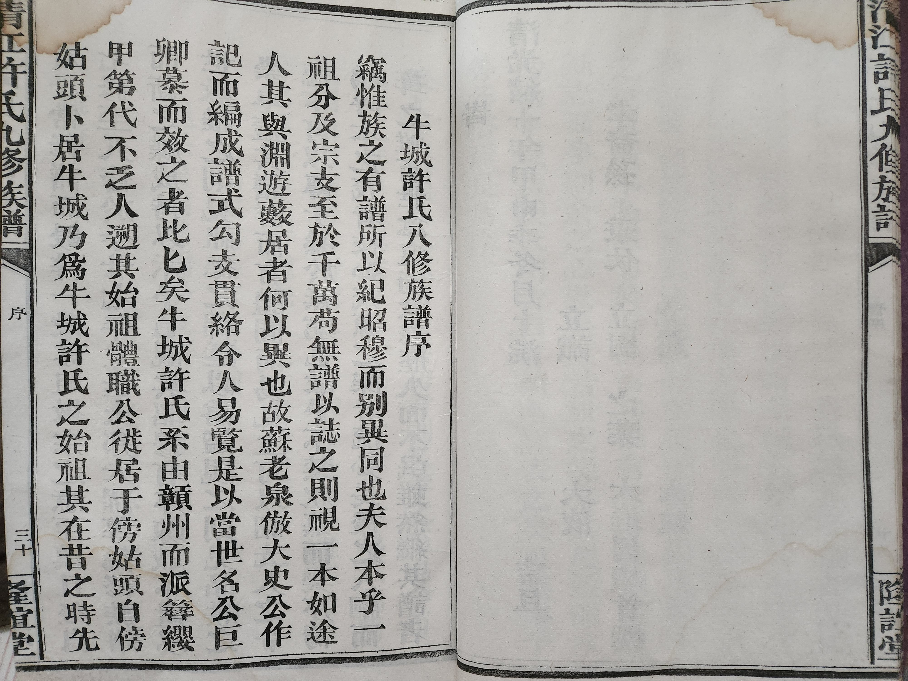
1. **牛城許氏八修族譜序 → 牛城许氏八修族谱序**  
   （牛城许氏八修族谱序**。）

2. **竊惟族之有譜所以紀昭穆而別異同也 → 窃惟族之有谱所以纪昭穆而别异同也**  
   （窃以为家族有谱是为了记载辈分，区分亲疏异同**。）

3. **夫人本乎一祖分及宗支至於千萬苟無譜以誌之則視一本如途人其與淵遊藪居者何以異也 → 夫人本乎一祖分及宗支至于千万，苟无谱以志之，则视一本如途人，其与渊游薮居者何以异也**  
   （人本源于同一祖先，分支宗支繁多，若无谱记载，则视同族如路人，与在深渊游玩、在草丛居住者有何区别**。）

4. **故蘇老泉倣大史公作記而編成譜式勾支貫絡令人易覽是以當世名公巨卿慕而效之者比匕矣 → 故苏老泉仿大史公作记而编成谱式，勾支贯络令人易览，是以当世名公巨卿慕而效之者比比皆是**  
   （所以苏老泉仿效大史公作记，编成谱式，勾连分支，贯穿脉络，使人易于查阅，因此当世名公巨卿纷纷效仿，比比皆是**。）

5. **牛城許氏系由贑州而派纓甲第代不乏人 → 牛城许氏系由赣州而派衍，甲第代不乏人**  
   （牛城许氏源自赣州，世代繁衍，高官显贵代不乏人**。）

6. **遡其始祖體職公徙居于傍姑自傍姑頭卜居牛城乃為牛城許氏之始祖 → 溯其始祖体职公徙居于傍姑，自傍姑头卜居牛城，乃为牛城许氏之始祖**  
   （追溯其始祖体职公迁徙居住在傍姑，后从傍姑头选择牛城定居，成为牛城许氏之始祖**。）
## 旧序-三一
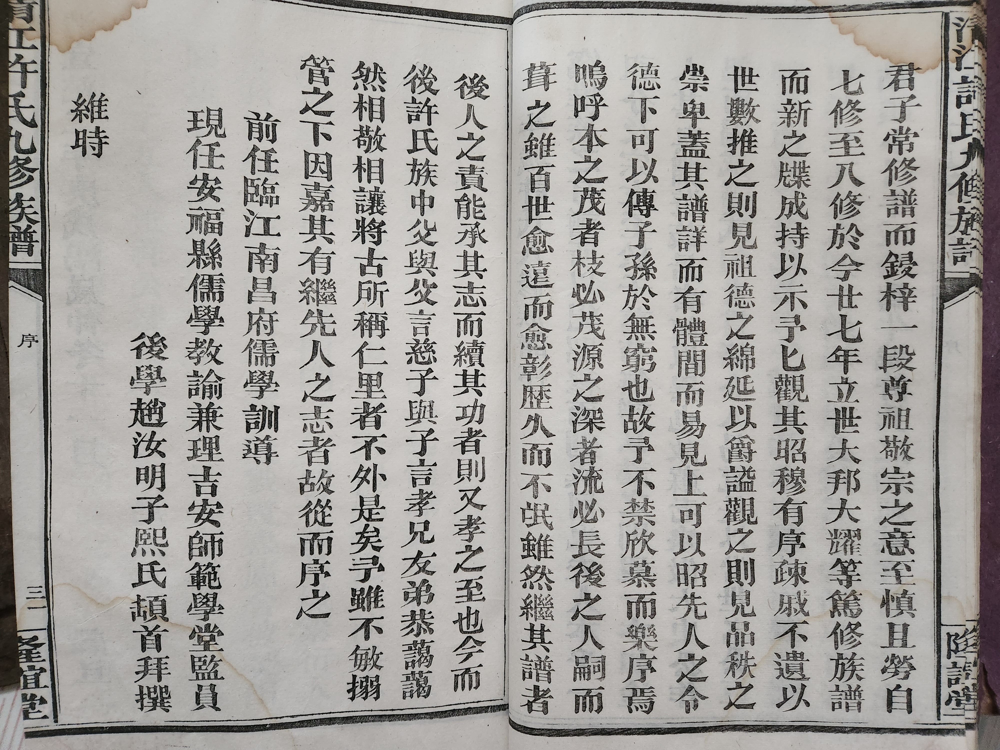
1. **君子常修譜而鋟梓 → 君子常修谱而镌梓**  
   （君子常常修订族谱并镌刻于梓木之上。）

2. **一段尊祖敬宗之意至慎且勞 → 一段尊祖敬宗之意，至慎且劳**  
   （这体现了对祖先和宗族的尊敬，非常慎重且辛劳。）

3. **七修至八修於今廿七年 → 七修至八修，于今二十七年**  
   （从第七次修订到第八次修订，到现在已经过去了二十七年。）

4. **立世大邦大耀等篤修族譜 → 立世大邦大耀等，笃修族谱**  
   （立世大邦大耀等人，致力于修订族谱。）

5. **而新之牒成持以示予匕觀其昭穆有序 → 而新之牒成，持以示予，观其昭穆有序**  
   （新的族谱修订完成后，拿给我看，我看到其昭穆次序井然。）

6. **疎戚不遺以世數推之則見祖德之綿延 → 疏戚不遗，以世数推之，则见祖德之绵延**  
   （亲疏不遗漏，按世代数推算，可见祖先德行之绵延不绝。）

7. **以爵謚觀之則見品秩之崇卑 → 以爵谥观之，则见品秩之崇卑**  
   （以爵位和谥号来看，可见品秩的高低。）

8. **蓋其譜詳而有體問而易見 → 盖其谱详而有体，问而易见**  
   （大概是因为族谱详尽而有体系，询问起来也容易明白。）

9. **上可以昭先人之令德下可以傳予孫於無窮也 → 上可以昭先人之令德，下可以传子孙于无穷也**  
   （上可以彰显先人的美德，下可以传给子孙无穷。）

10. **故予不禁欣慕而樂序焉 → 故予不禁欣慕而乐序焉**  
    （因此我忍不住欣喜和羡慕，并乐意为它作序。）

11. **嗚呼本之茂者枝必茂源之深者流必長 → 呜呼！本之茂者枝必茂，源之深者流必长**  
    （呜呼！树木的根茂盛，枝叶必然茂盛；源泉深邃，水流必然长远。）

12. **後之人嗣而葺之雖百世愈遠而愈彰 → 后之人嗣而葺之，雖百世愈遠而愈彰**  
    （后人继承并修缮它，即使过了百世，也会越来越显赫。）

13. **歴久而不氓雖然繼其譜者後人之責 → 历久而不泯，雖然繼其譜者，后人之責**  
    （历久而不消失，继承族谱，是后人的责任。）

14. **能承其志而續其功者則又孝之至也 → 能承其志而续其功者，则又孝之至也**  
    （能够继承先人的志向并延续其功绩，这是最大的孝道。）

15. **後許氏族中父與父言慈子與子言孝 → 后许氏族中，父与父言慈，子与子言孝**  
    （在许氏族中，父亲与父亲谈论慈爱，儿子与儿子谈论孝道。）

16. **兄友弟恭藹藹然相敬相讓 → 兄友弟恭，蔼蔼然相敬相让**  
    （兄长与弟弟和睦，和和气气地相互尊敬和谦让。）

17. **將古所稱仁里者不外是矣 → 将古所称仁里者，不外是矣**  
    （这正是古代所称的仁爱之乡。）

18. **予雖不敏搦管之下因嘉其有繼先人之志者 → 予雖不敏，搦管之下，因嘉其有繼先人之志者**  
    （我虽然不聪明，但拿起笔来，因为赞赏那些有继承先人志向的人。）

19. **故從而序之宜堂青工許氏九修族普序 → 故从而序之，宜堂青工许氏九修族谱序**  
    （所以为他们作序，这是宜堂青工许氏的第九次修订族谱序。）

20. **後學趙汝明子熙氏頓首拜撰 → 后学赵汝明子熙氏，頓首拜撰**  
    （后学赵汝明子熙氏，恭敬地撰写。）
## 旧序-三二

1. **清宣統二年庚戌鴻嵗仲冬十一月穀旦 → 清宣统二年庚戌鸿岁仲冬十一月谷旦**  
   （清宣统二年庚戌年，鸿岁（大吉之年）仲冬十一月吉日。）

2. **筆談録舊序 → 笔谈录旧序**  
   （笔谈录**的旧序言。）

3. **吾族之有譜自十一世瀧公纂述體職公本贑州府贛縣人以掌瀧灘鍾故覽山水之秀覩風俗之美淡然忘歸遂卜居於傍姑頭為開闢之始祖自後昌熾繁衍人文接踵 → 吾族之有谱自十一世濂公纂述，体职公本赣州府赣县人，以掌濂滩镇故，览山水之秀，覩风俗之美，淡然忘归，遂卜居于傍姑头，为开闢之始祖，自后昌炽繁衍，人文接踵**  
   （我们家族有谱始于第十一世濂公纂述，体职公本是赣州府赣县人，因掌管濂滩镇，所以欣赏山水的秀丽，目睹风俗的美好，淡然忘却归途，于是选择在傍姑头定居，成为开闢之始祖，自此以后家族昌盛繁衍，人文辈出。）

4. **迨元至正間懷遭宼變殺戮幾盡廬舍被燹田園坵墓大半主人非矣 → 迨元至正间，懞遭寇变，杀戮几尽，庐舍被燹，田园坵墓大半，主人非矣**  
   （到了元至正年间，遭遇寇乱，杀戮几乎殆尽，房屋被焚毁，田园坟墓大半荒废，主人已不复存在。）

5. **幸有十九世惟志公贅南源楊宅生子五人惟祥公肆業峽邑大明洪武徙居今址一綫相繼吾族復興 → 幸有十九世惟志公赘于南源杨宅，生子五人，惟祥公肆业峡邑，大明洪武徙居今址，一线相继，吾族复兴**  
   （幸运的是，有十九世惟志公赘居于南源杨宅，生了五个儿子，其中惟祥公在峡邑求学，大明洪武年间迁徙到现今的地址，一线相传，我们家族得以复兴。）

6. **傳至曾王父學初同父必遐公取家青工许氏九參族普蒨序 → 传至曾王父学初、同父必遐公，取家青工许氏，九参族谱，蒨序**  
   （传至曾王父学初、同父必遐公时，取家青工许氏之女为妻，参与九次修订族谱，撰写序言。）
## 族规-一

1. **族規 → 族规**  
   （家族的规章制度。）

2. **一祠堂創建原欲安祖考序尊卑管祠者宜時加掃 → 一祠堂创建原欲安祖考序尊卑，管祠者宜时加扫**  
   （祠堂的创建原本是为了安奉祖先，排列尊卑次序，管理祠堂的人应当按时打扫。）

3. **旁舍止許子孫讀書不許頓粗俗陋惡物件致使 → 旁舍止许子孙读书，不许顿粗俗陋恶物件致使**  
   （旁舍只允许子孙读书，不允许存放粗俗、丑陋、恶劣的物件。）

4. **一元旦謁祠吉慶之始也以辰特爲定各房尊卑須從 → 一元旦谒祠吉庆之始也，以辰时为定，各房尊卑须从**  
   （元旦谒祠是吉庆的开始，特别规定在辰时进行，各房的尊卑次序必须遵从。）

5. **吉服詣祠列坐候寶列班忝神畢然後昭穆相賀非 → 吉服诣祠列坐候齐，列班忝神毕，然後昭穆相賀（非字可能识别有误，此处忽略）**  
   （穿着吉服前往祠堂列坐等候，行列整齐后奏神完毕，然后按照昭穆次序相贺。）

6. **親喪不得一槪服白有乖於體 → 親（此处应为“舅”，识别有误）丧不得一概服白，有乖于体**  
   （舅舅的丧事不能一律穿白色衣服，这不合体统。）

7. **一宗廟以有事為榮必子弟雍容嫻於禮者為之不得 → 一宗庙以有事为荣，必子弟雍容娴于礼者为之，不得**  
   （宗庙有事是家族的荣耀，必须由子弟中仪态端庄、熟悉礼仪的人来主持，不得随意。）

8. **青工许氏九参俟普族規 → 青工许氏九参（此处可能信息不完整或识别有误），俟普族规**  
   （青工许氏的第九次参与或修订，等待普及族规。）
## 族规-二
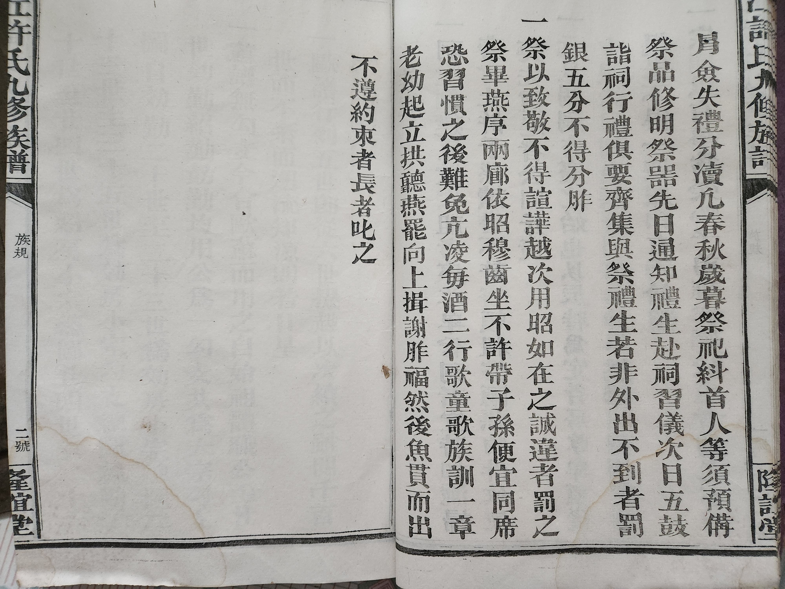
1. **月僉失禮分凟凢春秋歲暮祭祀糾首人等須預備 → 月儉失禮，分凟幾春秋，歲暮祭祀，糾首人等須預備**  
   （月俭失礼**，经过数载春秋，年末祭祀时，纠首等人需提前准备。）

2. **祭晶修明祭噐先日通知禮生赴祠習儀次日五鼓 → 祭品修明，祭器先日通知禮生赴祠習儀，次日五鼓**  
   （祭品**要备齐，**祭器**需提前一天通知礼生到祠堂练习仪式，次日清晨五点开始。）

3. **詣祠行禮俱要齊集與祭禮生若非外出不到者罰銀五分不得分一祭以致敬不得諠譁越次用昭如在之誠違者罰之 → 詣祠行禮，俱要齊集與祭，禮生若非外出不到者，罰銀五分，不得分胙。祭以致敬，不得諠譁越次，用昭如在之誠，違者罰之**  
   （到祠堂行礼，所有人都要参加，礼生若非因外出缺席，罚银五分且不得参与分胙。祭祀时需致以敬意，不得喧哗越次，以彰显如在之诚，违者将受罚。）

4. **祭畢燕序兩廊依昭穆齒坐不許帶子孫便宜同席 → 祭畢，燕序兩廊，依昭穆齒坐，不許帶子孫便宜同席**  
   （祭祀结束后，宴请在两廊进行，按昭穆顺序就座，不得带子孙随意同席。）

5. **恐習恨之後難免亢凌每酒二行歌童歌族訓一章 → 恐習慣之後難免亢凌，每酒二行，歌童歌族訓一章**  
   （担心习惯之后难免有争斗，每两轮酒过后，歌童唱诵族训一章。）

6. **老幼起立拱聽燕罷向上揖謝胙福然後魚貫而出不遵約束者長者叱之 → 老幼起立拱聽，燕罷向上揖謝胙福，然後魚貫而出。不遵約束者，長者叱之**  
   （老幼起立恭听，宴罢向上揖谢胙福，然后依次退出。不遵守约束者，长者将责备之。）
## 族议-一
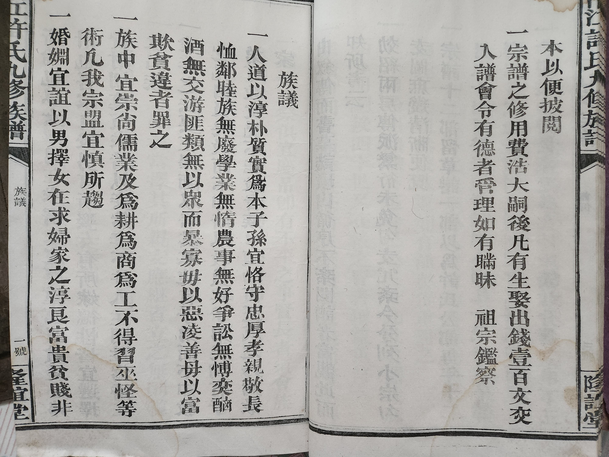
1. **本以便披閱 → 本以便披阅**  
   （此书便于阅读。）

2. **一宗譜之修用費浩大嗣後凡有生娶出錢壹百文交 → 一宗谱之修用费浩大，嗣后凡有生娶，出钱壹百文交**  
   （修撰宗谱费用庞大，今后凡有生子娶妻之事，需缴纳钱壹百文。）

3. **入譜會令有德者管理如有瞞昧祖宗鑑察 → 入谱会令有德者管理，如有瞒昧，祖宗鉴察**  
   （族谱的管理交由有德行之人，若有隐瞒不实，祖宗自会明察。）

4. **一人道以淳朴質實爲本子孫宜恪守忠厚孝親敬長 → 一人道以淳朴质实为本，子孙宜恪守忠厚，孝亲敬长**  
   （为人之道应以淳朴诚实为根本，子孙后代应当坚守忠厚之道，孝顺父母，尊敬长辈。）

5. **恤鄰睦族無廢學業無惰農事無好爭訟無愽酗酒無交淤匪類 → 恤邻睦族，无废学业，无惰农事，无好争讼，无酗酒，无交匪类**  
   （体恤邻里，和睦宗族，不可荒废学业，不可懒惰于农事，不可喜好诉讼，不可酗酒，不可结交匪类。）

6. **無以眾而寡毋以惡凌善毋以富欺貧違者罪之 → 无以众凌寡，毋以恶欺善，毋以富欺贫，违者罪之**  
   （不得以人多欺压人少，不得以恶行欺凌善良，不得以富贵欺凌贫穷，违者将受到惩罚。）

7. **一族中宜崇尚儒業及爲耕爲商爲工不得習巫怪等術 → 一族中宜崇尚儒业，及为耕、为商、为工，不得习巫怪等术**  
   （家族中应崇尚儒学，以及从事农耕、商业、手工业，不得学习巫术等怪异之术。）

8. **凢我宗盟宜慎所趨 → 凡我宗盟，宜慎所趋**  
   （凡是我宗族联盟之人，应当谨慎自己的言行举止。）

9. **一婚婣宜誼以男擇女在求婦家之淳良 → 一婚姻宜谊，以男择女，在求妇家之淳良**  
   （婚姻应当讲究情谊，男方选择女方时，应寻求品德淳良的家庭。）

10. **工许氏九参族普 → 此处可能识别有误，结合上下文无法确定具体含义**
## 族议-二
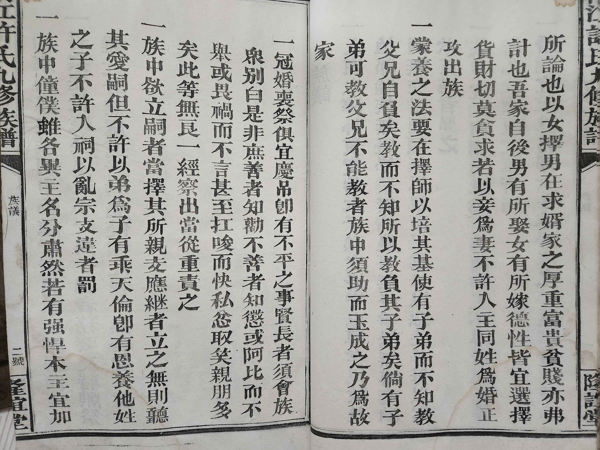
1. **所論也以女擇男在求婚家之厚重富貴貧賤亦弗 計也 → 所论也以女择男在求婚家之厚重富贵贫贱亦弗计也**  
   （所讨论的，是以女子选择男子时，在求婚的家庭中，不论其家世厚重、富贵或贫贱，都不应计较。）

2. **吾家自後男有所娶女有所嫁德性皆宜選擇 貨財切莫貪求 → 吾家自后男有所娶女有所嫁德性皆宜选择 货财切莫贪求**  
   （我家以后，男子娶妻，女子出嫁，都应选择品德优良之人，财物切勿贪求。）

3. **若以妄爲妻不許入王同姓爲婚正 攻出族 → 若以妾为妻不许入主同姓为婚 正攻出族**  
   （若将妾室视为正妻，则不允许与同姓之人结婚，此行为将被逐出宗族。）

4. **一蒙養之法要在擇師以培其基使有子弟而不知教 → 一蒙养之法要在择师以培其基 使有子弟而不知教**  
   （启蒙教育的方法，关键在于选择良师以培养其基础，使有子弟却不知教育。）

5. **教而不知所以教負其子弟矣倘有子 弟可教父兄不能教者 → 教而不知所以教 负其子弟矣 倘有子弟可教父兄不能教者**  
   （教育却不知如何教育，辜负了子弟。倘若有子弟可以教育，而父兄却不能教育。）

6. **族中須助而玉成之乃爲故 家 → 族中须助而玉成之 乃为故家**  
   （族中须帮助完成教育，才能成为世家。）

7. **一冠婚喪祭俱宜慶吊卽有不平之事賢長者須會族 → 一冠婚丧祭俱宜庆吊 即有不平之事贤长者须会族**  
   （成年礼、婚礼、丧礼、祭祀都应庆吊，若有不平之事，贤长者须召集族人。）

8. **別白是非庶善者知勸不善者知懲 → 别白是非 庶善者知劝不善者知惩**  
   （分辨是非，使善良的人知道被劝勉，不善的人知道受到惩罚。）

9. **一族中欲立嗣者當擇其所親交應継者立之無則聽 其愛嗣但不許以弟爲子 → 一族中欲立嗣者 当择其所亲支应继者立之 无则听其爱嗣 但不许以弟为子**  
   （家族中欲立嗣者，应选择亲近的支系中应继者立之，若无则听其选择所爱之嗣，但不许以弟弟为子。）

10. **有乖天倫卽有恩養他姓之子不許入祠以亂宗支違者罰 → 有乖天伦 即有恩养他姓之子 不许入祠以乱宗支 违者罚**  
    （有违天伦，即使有恩养他姓之子，也不许入祠以扰乱宗支，违者将受到惩罚。）
## 谱例-一
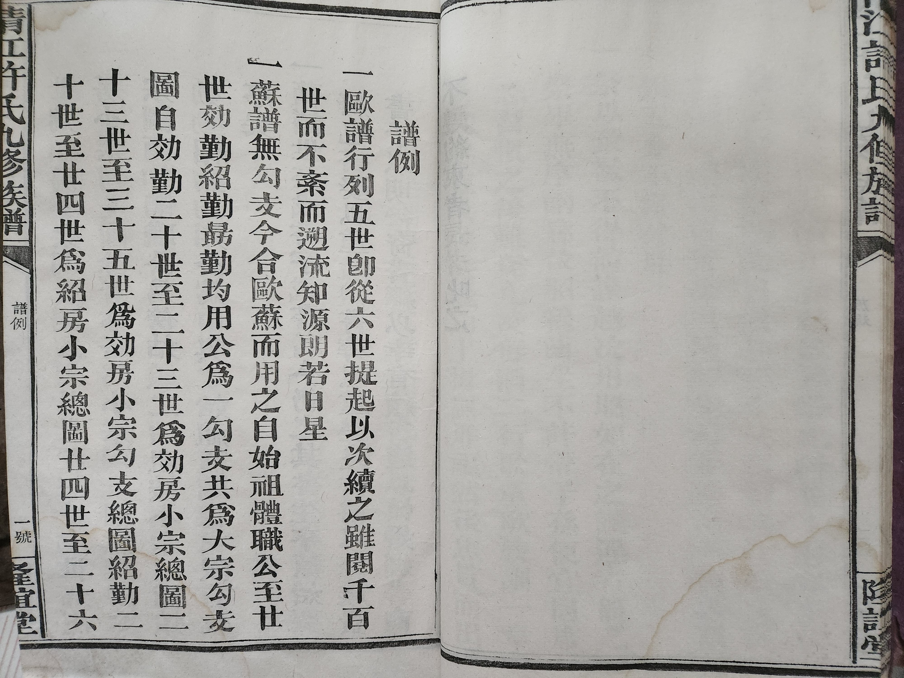
1. **一歐譜行列五世卽從六世援起以次續之雖閱千百 世而不而遡流知源朗若日星 → 一欧谱行列五世即从六世援起以次续之，虽阅千百世而不紊，溯流知源朗若日星**  
   （一欧的族谱排列，从第五世开始便接着第六世依次延续，即使历经千百世也不混乱，追溯源流清晰如同日星。）

2. **一譜無勾支今會歐蘇而用之自始祖體職公至廿 世効勤紹勤勤均用公爲一勾支共為大宗勾支 → 一谱无勾支，今合欧苏而用之，自始祖体职公至廿世，效勤、绍勤均用公为一勾支，共为大宗勾支**  
   （某谱原本无勾支，现今合并欧苏两谱使用，从始祖体职公至第二十世，效勤、绍勤等都以公为一勾支，共同构成大宗勾支。）

3. **圖自効勤二十世至二十三世爲効房小宗勾支總圖二 十三世至三十五世爲効房小宗勾支總圖 → 图自效勤二十世至二十三世为效房小宗勾支总图，二十三世至三十五世为效房小宗勾支总图**  
   （图示从效勤第二十世至二十三世为效房小宗勾支的总图，二十三世至三十五世亦是效房小宗勾支的总图。）

4. **紹勤二十世至廿四世爲紹房小宗總廿四世至二十六 青工许氏九参族普譜例 → 绍勤二十世至廿四世为绍房小宗总图，廿四世至二十六世（此处可能有遗漏或识别错误），青工许氏九参族谱例**  
   （绍勤从第二十世至廿四世为绍房小宗的总图，廿四世至二十六世（信息可能不完整），以及青工许氏的九参族谱的例则。）
## 谱例-二
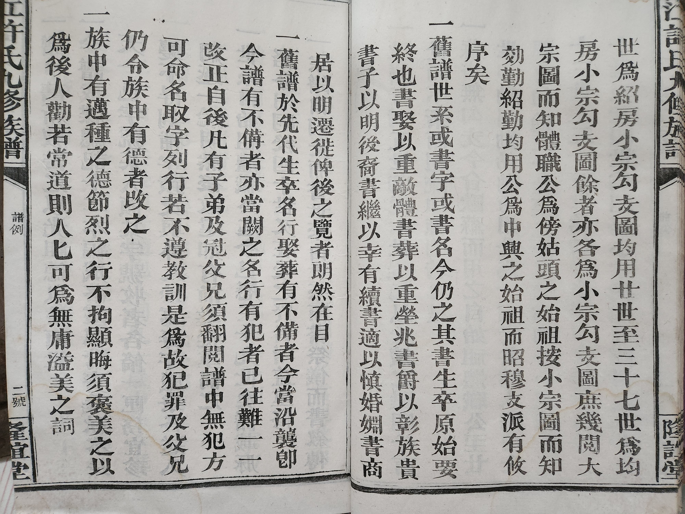
1. **世爲紹房小宗勾支圖均用廿世至三十七世爲均 → 世为绍房小宗勾支图均用二十世至三十七世为均**  
   （描述的是房小宗勾支图的世代范围，从二十世到三十七世。）

2. **房小宗勾支圖餘者亦各爲小宗勾支圖庶幾閱大 → 房小宗勾支图，余者亦各为小宗勾支图，庶几阅大**  
   （说明除了主要的房小宗勾支图外，其余的也各自有小宗勾支图，以便查阅。）

3. **宗圖而知體職公爲傍姑頭之始祖按小宗圖而知 → 宗图而知体职公为傍姑头之始祖，按小宗图而知**  
   （通过宗图可以了解到体职公是傍姑头的始祖，按小宗图也能得知相关信息。）

4. **効勤紹勤均用公爲申興之始祖而昭穆支派有攸 → 劝勤绍勤均用公为中兴之始祖，而昭穆支派有攸**  
   （劝勤绍勤均用公被尊为中兴的始祖，其昭穆支派有所关联。）

5. **一舊譜世系或書字或書名今仍之其書生卒原始要 → 一旧谱世系，或书字或书名，今仍之，其书生卒原始要**  
   （旧谱中的世系，有的记录字，有的记录名，现今仍沿用此方式，且记录生卒年月及重要事迹。）

6. **終也書娶以重敵體書葬以重塋兆書爵以彰族貴 → 终也，书娶以重敌体，书葬以重塋兆，书爵以彰族贵**  
   （记录终结时，书写娶妻以重视家族延续，书写葬礼以重视墓地，书写爵位以彰显家族尊贵。）

7. **書子以明後裔書繼以幸有續書適以慎婚婣書商 → 书子以明后裔，书继以幸有续，书适以慎婚媾，书商居以明迁徙**  
   （书写子女以明确后裔，书写继嗣以希望有延续，书写婚嫁以谨慎选择，书写商居以明确迁徙情况。）

8. **居以明遷徙俾後之覽者朗然在目 → 居以明迁徙，俾后之览者朗然在目**  
   （记录居住地以明确迁徙路径，使后来的查阅者一目了然。）

9. **一舊譜於先代生卒名行娶葬有不備者今當沿襲卽 → 一旧谱于先代生卒名行娶葬有不备者，今当沿袭即**  
   （旧谱中对于先代的生卒年月、名字、品行、婚娶、葬礼等记录不全的，现今应当沿袭并补充。）

10. **今譜有不備者亦當闕之名行有犯者已往難一一 → 今谱有不备者，亦当阙之；名行有犯者，已往难一一**  
    （现今的谱牒中如有记录不全的，也应当空缺；名字品行有冲突的，以往难以一一更正。）

11. **改正自後凡有子弟及冠父兄須翻閱譜中無犯方 → 改正自后，凡有子弟及冠，父兄须翻阅谱中无犯方**  
    （改正自后，凡有子弟成年，父兄需翻阅谱牒确保无重复名字品行。）

12. **可命名取字列行若不遵教訓是為故犯罪及父兄 → 可命名取字列行，若不遵教训，是为故犯，罪及父兄**  
    （可以命名取字排列辈分，如果不遵守教训，就是故意犯错，罪责会连累到父兄。）

13. **仍令族中有德者改之 → 仍令族中有德者改之**  
    （仍然让族中有德行的人来进行更正。）

14. **一族中有邁種之德節烈之行不拘顯晦須褒美之以 → 一族中有迈种之德、节烈之行，不拘显晦，须褒美之以**  
    （一族中有卓越品德、节烈行为的人，不论其名声是否显赫，都应当予以褒扬赞美。）

15. **為後人勸若常道則人匕可為無庸溢美之詞 → 为后人劝，若常道，则人皆可为无庸溢美之词**  
    （作为对后人的劝勉，如果是常理之道，那么人人都可以做到，无需过分赞美之词。）
## 谱例-三
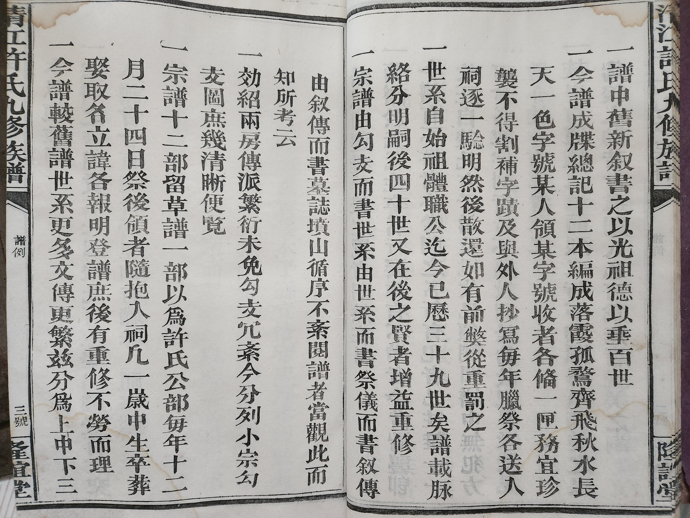
1. **一譜中新叙書之以光祖德以埀百世 → 一譜中新叙書之以光祖德以垂百世**  
   （一谱中新叙书之以光祖德以垂百世）  
   （在族谱中新撰写的内容，旨在光耀祖先的德行，流传百世。）

2. **今譜成牒總記十二本編成落霞孤鶩齊飛秋水長天一色字號某人領某字號收者各偹一匣務宜珍襲不得割補字蹟及與外人抄寫每年臘祭各送人祠逐一驗明然後散還如有前𡚁從重罰之 → 今譜成牒總記十二本編成落霞孤鷺齊飛秋水長天一色字號某人領某字號收者各備一匣務宜珍襲不得割補字蹟及與外人抄寫每年臘祭各送入祠逐一驗明然後散還如有違反從重罰之**  
   （今谱成牒总记十二本编成落霞孤鹜齐飞秋水长天一色字号某人领某字号收者各备一匣务宜珍袭不得割补字迹及与外人抄写每年腊祭各送入祠逐一验明然后散还如有违反从重罚之）  
   （如今族谱已成，总记十二本，封面以“落霞孤鹜齐飞秋水长天一色”为号，各字号由指定人领取并珍藏于匣中，不得损坏字迹或私自抄录。每年腊祭时，需送入祠堂逐一查验，而后归还。如有违反，将受到重罚。）

3. **一世系自始祖體職公迄今已厯三十九世矣譜載脉絡分明嗣後四十世又在後之賢者增益重修 → 一世系自始祖體職公迄今已歷三十九世矣譜載脈絡分明嗣後四十世又在後之賢者增益重修**  
   （一世系自始祖体职公迄今已历三十九世矣谱载脉络分明嗣后四十世又在后之贤者增益重修）  
   （世系自始祖体职公开始，至今已历经三十九世。族谱中记载清晰，脉络分明。未来的四十世，还需后世的贤者继续增益并重修。）

4. **一宗譜由勾支而書世系由世系而書祭儀而書叙傳 → 一宗譜由勾支而書世系，由世系而書祭儀，而書叙傳**  
   （一宗谱由勾支而书世系，由世系而书祭仪，而书叙传）  
   （宗谱从勾支开始记录世系，再由世系记录祭仪，最后记录叙传。）

5. **由叙傳而書墓誌墳山循序不紊閱譜者當觀此而知所考云 → 由叙傳而書墓誌，墳山循序不紊，閱譜者當觀此而知所考云**  
   （由叙传而书墓志，坟山循序不紊，阅谱者当观此而知所考云）  
   （由叙传进而记录墓志，坟山的记录也井然有序。阅谱者应当通过这部分内容来了解所考之事。）

6. **一効紹兩房傳派繫衍未免勾支冗素今分列小宗勾麥圖庶幾清晰使覽 → 一效紹兩房傳派繁衍，未免勾支冗紊，今分列小宗勾支圖，庶幾清晰使覽**  
   （一效绍两房传派繁衍，未免勾支冗紊，今分列小宗勾支图，庶几清晰便览）  
   （一效绍两房的传派繁衍众多，勾支关系难免冗乱。如今分列小宗的勾支图，使得浏览更为清晰。）

7. **宗譜十二部留草譜一部以爲許氏公部每年十二月二十四日祭後領者隨抱入祠凢一嵗中生卒葬娶取名立諱各報明登譜庶後有重修不勞而理 → 宗譜十二部留草譜一部以爲許氏公部，每年十二月二十四日祭後領者隨抱入祠，凡一歲中生卒葬娶取各立諱各報明登譜，庶後有重修不勞而理**  
   （宗谱十二部留草谱一部以为许氏公部，每年十二月二十四日祭后领者随抱入祠，凡一岁中生卒葬娶取各立讳各报明登谱，庶后有重修不劳而理）  
   （宗谱共有十二部，另留一部草谱作为许氏公部之用。每年十二月二十四日祭祀后，领取者需将族谱抱入祠堂。凡一岁中发生的生、卒、葬、娶等事宜，需各自立讳并上报登记于谱中，以便日后重修时无需费力整理。）

8. **一今譜較舊譜世系更多文傳更繁兹分爲上中下三 → 一今譜較舊譜世系更多，文傳更繁，兹分為上中下三**  
   （一今谱较旧谱世系更多，文传更繁，兹分为上中下三）  
   （如今的族谱相比旧谱，世系更为繁多，文传也更为丰富。因此，将其分为上、中、下三部分。）
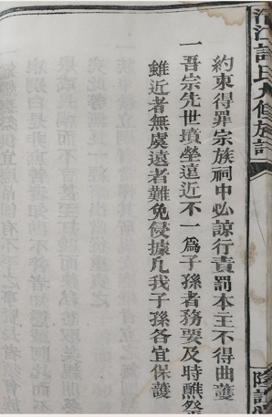
1. **約東得罪宗族祠中必諒行責罰本主不得曲蓮 → 約束得罪宗族祠中必諒行責罰，本主不得曲護**  
   （约束**族人在宗族祠堂中**犯错**必须公正执行责罚，族长或负责人不得偏袒。）

2. **一吾宗先世墳塋遠近不一爲子孫者務要及時醮祭 → 一吾宗先世墳塋遠近不一，為子孫者務要及時醮祭**  
   （我们**宗族的先祖坟墓**远近**各不相同，作为**子孙**一定要及时进行祭祀。）

3. **雖近者無虞遠者難免侵據凢我子孫各宜保護 → 雖近者無虞，遠者難免侵據，凡我子孫各宜保護**  
   （即使是近处的坟墓也**不用担心**，但远处的坟墓则**难免**被侵占，**所有**子孙都应该加以保护。）
## 勾支图-01
* 一世至二十世勾支总图
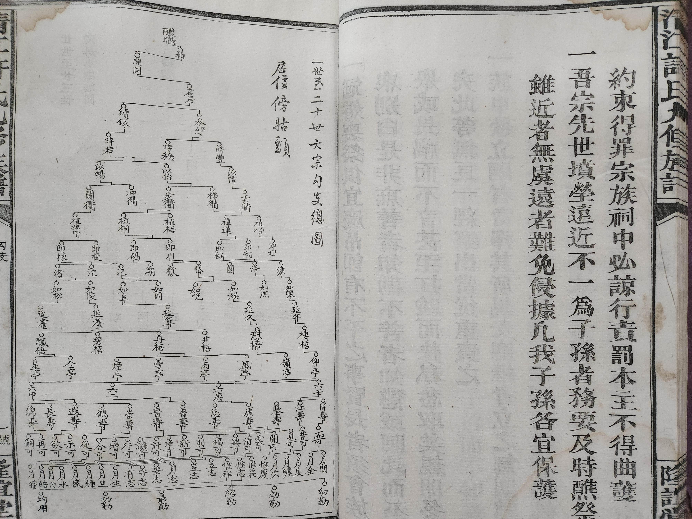
## 勾支图-02
* 廿世至廿三世-劾房小宗勾支總圖
* 廿三世至三三世-劾房小宗勾支图
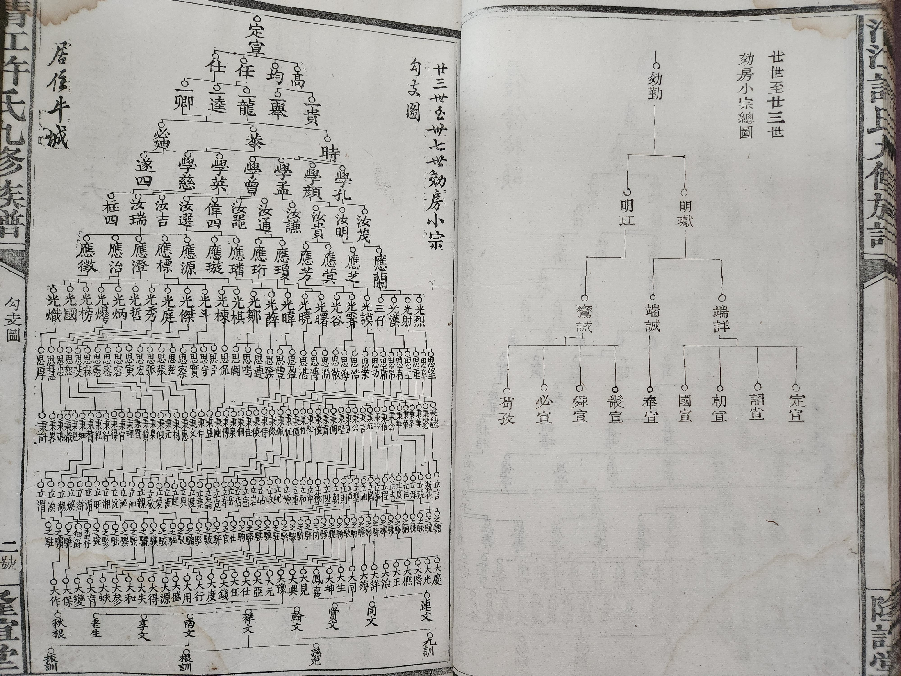
## 勾支图-03
* 廿三世至三六世-劾房小宗勾支图
* 廿十至廿四世-绍房小宗勾支图
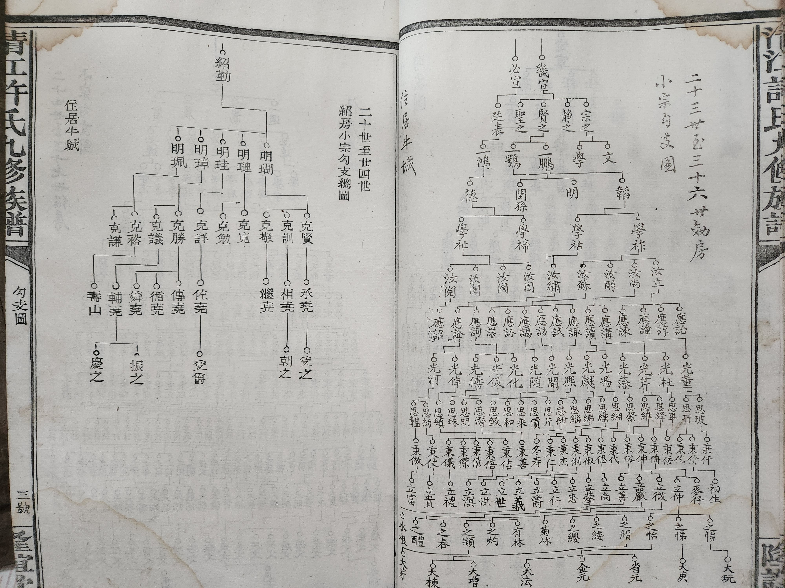
## 勾支图-04
* 廿四至三十七世-绍房小宗勾支图
* 廿四至三十二世-绍房小宗勾支总图
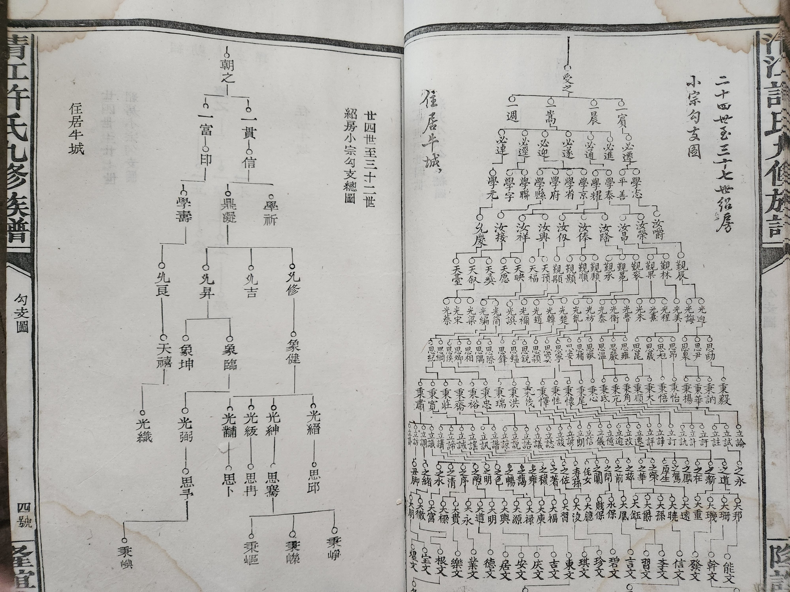
## 勾支图-05
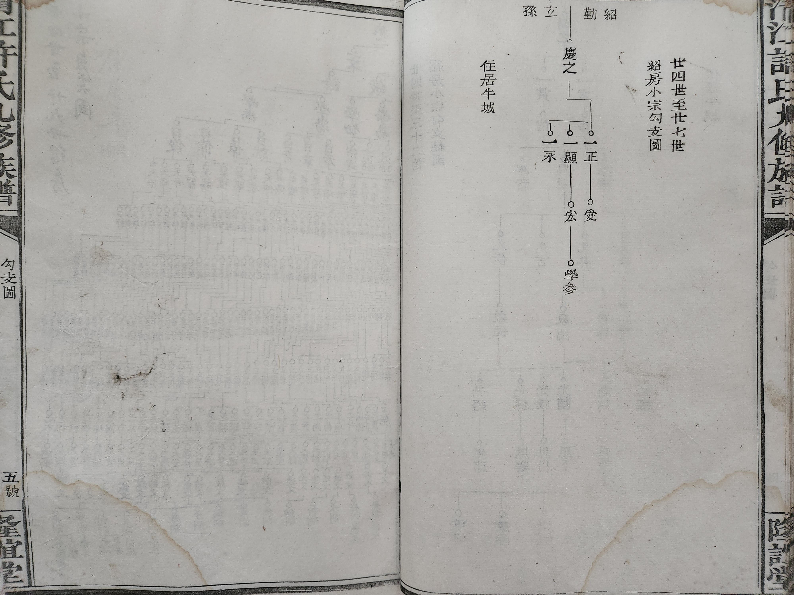
## 勾支图-06
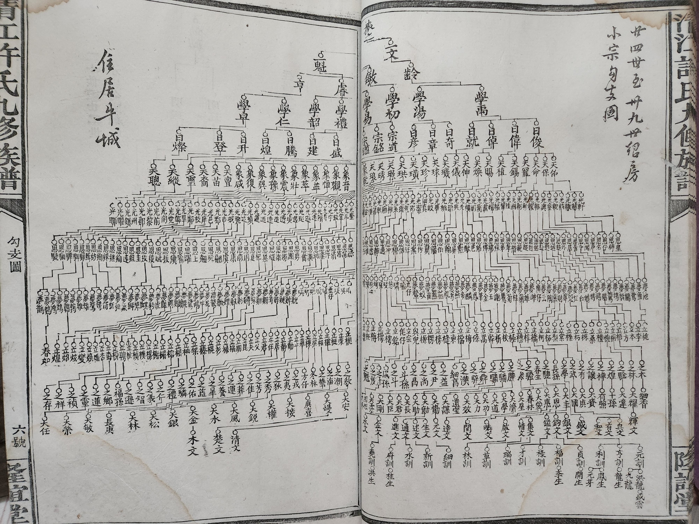
## 勾支图-07
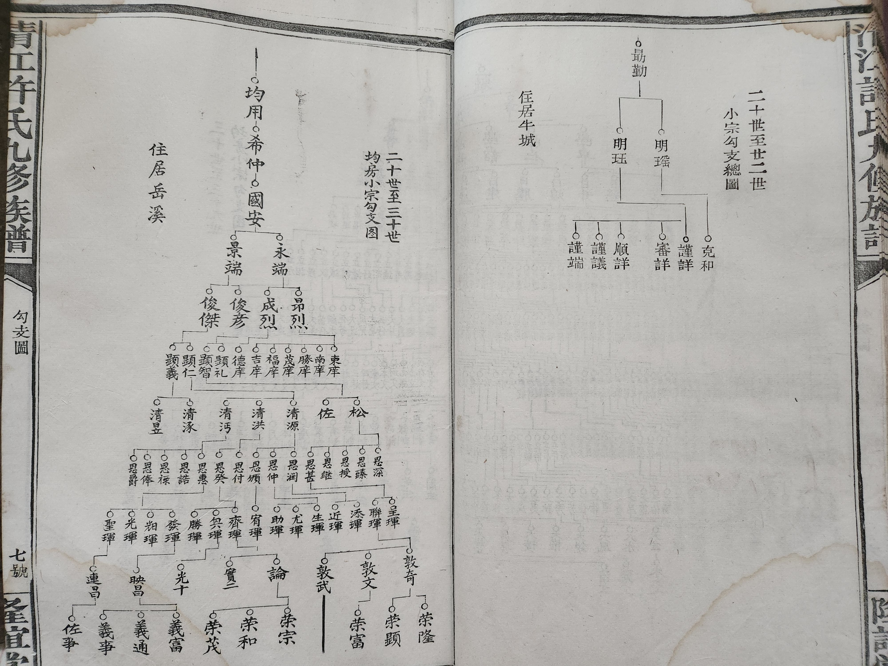
## 勾支图-08
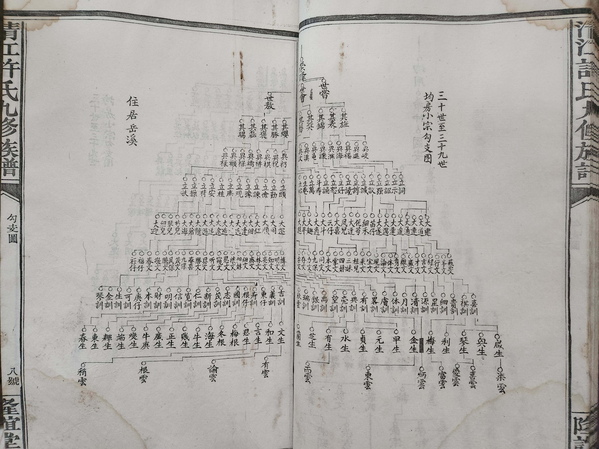
## 勾支图-09
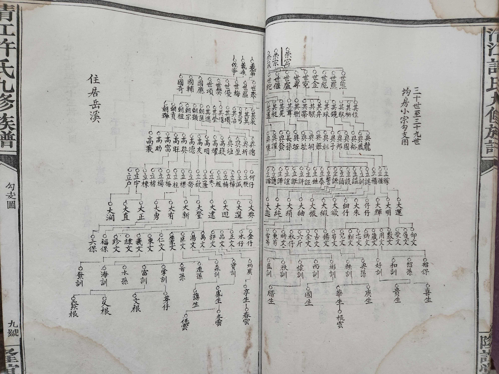
## 勾支图-10
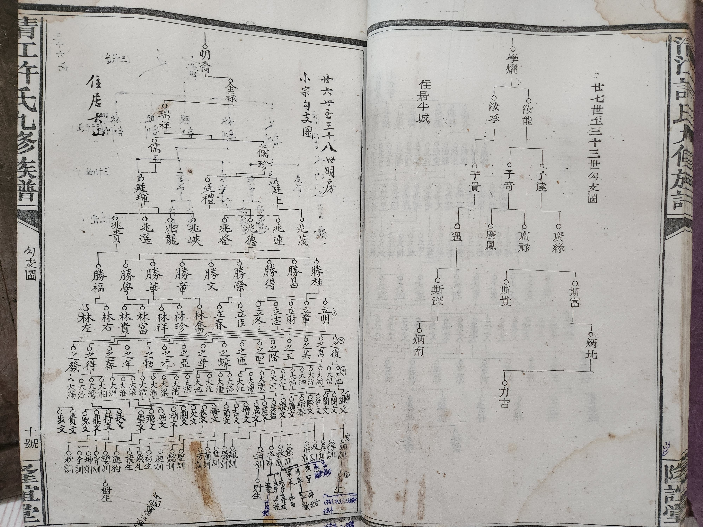
## 勾支图-11
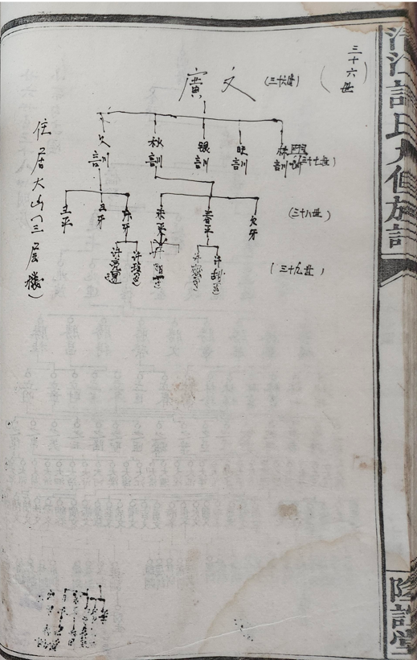
## 傍故头世系
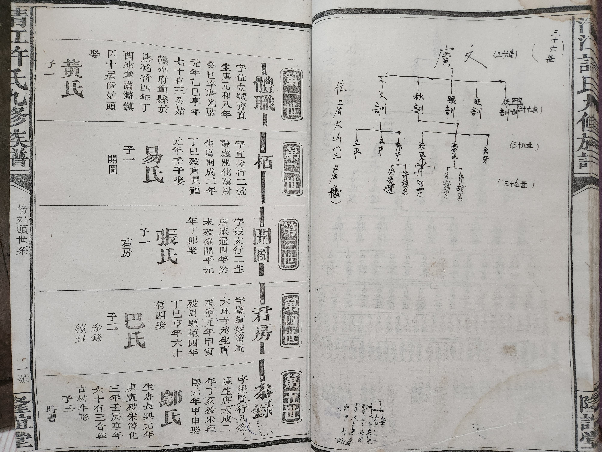
